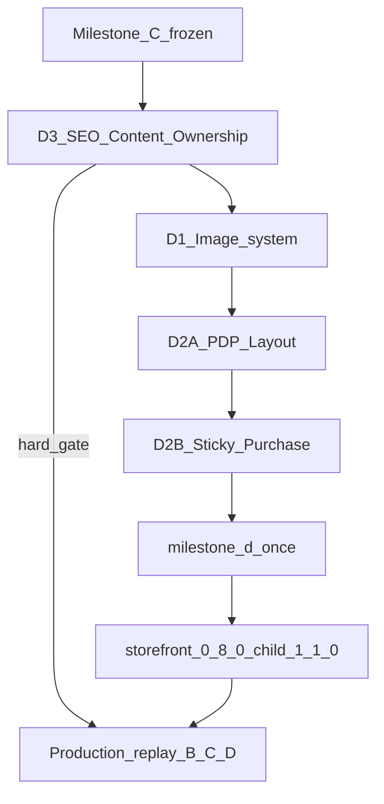
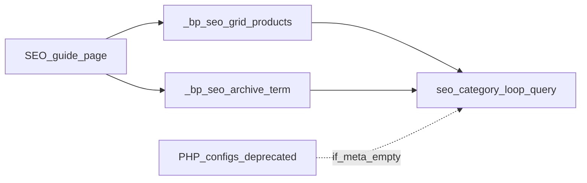

# Milestone D — Implementation Specification (FROZEN)

**Status:** **FROZEN** — definitive implementation specification  
**Do not implement** until this frozen plan receives explicit execution approval  
**Prerequisite baseline:** Milestone C COMPLETE (`biopentra-loop-card` **v1.6.0** @ `5260a84`)  
**Target versions:** `biopentra-storefront` **0.8.0**, `biopentra-blocksy-child` **1.1.0**  
**Roadmap:** [ROADMAP.md](../ROADMAP.md) § Milestone D

---

## Milestone invariants

These rules are mandatory for the entire Milestone D lifecycle:

1. **Production gate (hard):** No production replay of Milestones **B**, **C**, or **D** is permitted until **D3 (SEO Content Ownership)** has completed successfully (CLI applied, runtime page-owned, PHP product inventories removed, targeted validation green).
2. **Test execution policy:** During implementation run **only** targeted Playwright suites and affected validation. Run the complete `--milestone-d` suite **exactly once** before tagging and release. Do not rerun hundreds of tests after small CSS/layout changes unless shared infrastructure changed.
3. **D2 subdivision:** D2 remains one milestone package externally; internally implement as **D2A** then **D2B** — not a separate milestone.
4. **No checkout / gateway / cart AJAX changes.**
5. **Architecture changes** to this frozen plan require product-owner approval before coding.

---

## 1. Executive summary

| WP | Name | Goal | Primary owner |
|---|---|---|---|
| **D3** | **SEO Content Ownership** | Move curated SEO guide product/content ownership from plugin PHP to page-owned data | `biopentra-storefront` |
| **D1** | Image system | Cap heroes/cards/PDP gallery; ship SDS tokens; LCP/`sizes`/lazy policy | storefront + loop-card + Blocksy Customizer |
| **D2A** | Product Detail Layout | Gallery, images, price, stock, trust, disclaimer, related, upsells, responsive layout | `biopentra-blocksy-child` + storefront modules |
| **D2B** | Sticky Purchase Experience | Sticky bar, variation/ATC sync, IntersectionObserver, a11y, safe-area, keyboard, mobile interaction | `biopentra-blocksy-child` |

**Locked decisions:**

1. **Order:** D3 → D1 → D2A → D2B → `--milestone-d` once → tags.
2. PDP = Blocksy + Customizer via **child theme** (not Elementor single-product Theme Builder).
3. Sticky bar = greenfield in child, **mobile only**, SDS `--bp-z-sticky-bar`.
4. CookieYes / WOOCS UI conflicts → **Milestone E**; D defines z-index stack only.
5. Related/upsells already canonical (C); **D2A** unhides Blocksy `ct-hidden-sm/md` on mobile/tablet.
6. No ACF/editor UI for SEO grids in D.
7. Cross-sells: C adapter ready; no invented catalog data.



---

## 2. D1 — Image system

### Current implementation

| Area | Owner today | State |
|---|---|---|
| Home hero | Elementor **4444** + `home-v2.css` | CSS bg; max-height ~28vh |
| Shop hero | Elementor **3755** + `shop-v2.css` | CSS bg; max-height 24vh / 20vh mobile |
| SEO heroes | Elementor 4430–4432 | Overlay; no full-bleed product hero |
| Card images | Loop **3608** + `loop-card.css` | 1:1; often 600×600 WebP source |
| PDP gallery | Blocksy Customizer + Flexy | Sticky/tall on mobile possible |
| SDS tokens | Docs `tokens.css` only | **`bp-tokens.css` not enqueued** |
| `sizes` / lazy / LCP | WP/Elementor defaults | No Biopentra commercial filters |

### Problems

1. SDS tokens not production-enqueued.
2. Missing card `sizes` → over-fetch.
3. No explicit LCP policy on first commercial image.
4. PDP gallery sticky/tall vs SDS 50vh mobile cap.
5. Trust icons served at full size for ~50px display.

### Proposed solution

- Ship `biopentra-storefront/assets/css/bp-tokens.css` (from SDS) + enqueue globally; add `--bp-pdp-gallery-max-h-*`.
- Heroes: Elementor owns media; CSS caps to SDS.
- Cards: loop-card consumes SDS vars; attachment `sizes` + first-card eager/`fetchpriority`.
- PDP gallery caps: Customizer (unsticky mobile) + child CSS; preserve zoom/lightbox.
- Trust icons: smaller image size or CSS max-height.

### Ownership matrix

| Concern | Elementor | Blocksy | WooCommerce | Storefront | Loop-card | Child |
|---|---|---|---|---|---|---|
| Home/shop hero media | Own | — | — | CSS caps | — | — |
| Card featured image | Template 3608 | — | image sizes | tokens enqueue | CSS + sizes filter | — |
| PDP gallery/zoom | — | Own | templates | — | — | CSS caps |
| SDS tokens file | — | — | — | Own | consume | consume |

### Affected files

- `plugins/biopentra-storefront/assets/css/bp-tokens.css` (new)
- `includes/class-biopentra-storefront.php` (enqueue)
- `home-v2.css` / `shop-v2.css`
- `loop-card.css` + small PHP filter in loop-card
- `biopentra-blocksy-child` PDP gallery CSS
- Docs: `design-system/image-guidelines.md`; `changes/milestone-D1-images.md`

**Validation:** `--d1-only` after D1.  
**Rollback:** revert storefront/loop-card/child releases; restore Customizer; flush CSS/cache.

---

## 3. D2 — Product detail experience (internally D2A + D2B)

Milestone numbering stays **D2**. Implementation is two sequential work packages.

### Current state

- PDP = Blocksy parent; child 1.0.0 checkout-only; **not bind-mounted** (`dev/biopentra-blocksy-child/docs/DEV-SYNC.md`).
- Stock + CVSS live in storefront; related/upsells canonical but Blocksy-hidden on mobile; **no sticky bar**.

### D2A — Product Detail Layout

**Includes:** gallery · images · price · stock · trust · disclaimer · related · upsells · responsive layout

| Item | Work |
|---|---|
| Gallery / thumbs | Height caps (from D1 tokens); disable mobile sticky gallery; thumb touch ≥44px |
| Price / stock | SDS price typography; stock-display above fold |
| Trust / shipping / disclaimer | Keep content; disclosure if purchase controls pushed >1 viewport |
| Related / upsells | Unhide `ct-hidden-sm/md`; confirm canonical enhance |
| Responsive | Mobile + desktop layouts per wireframes |
| Cross-sells | Smoke if fixtures exist |

**Exit:** `--d2a-only` green (layout/gallery/related/price/stock; **no** sticky-bar assertions required).

### D2B — Sticky Purchase Experience

**Includes:** sticky purchase bar · variation sync · ATC sync · IntersectionObserver · accessibility · safe-area · keyboard · mobile interaction

| Item | Work |
|---|---|
| Sticky bar | Mobile-only fixed bottom; mirror price/variation/ATC from native form |
| Sync | `found_variation` / `reset_data` / CVSS; no parallel cart endpoint |
| Visibility | IntersectionObserver — hide when native ATC in view |
| A11y | `role="region"`, focus management, keyboard, touch ≥44px |
| Safe area | `env(safe-area-inset-bottom)` |
| Z-index | Apply SDS stack from D1 tokens |

**Z-index contract:** `--bp-z-sticky-bar` 100 · `--bp-z-header` 200 · `--bp-z-cookie` 300 · `--bp-z-overlay` 400

**Exit:** `--d2b-only` green (sticky bar behaviour + a11y).

### Wireframes

**Mobile**

```text
┌─────────────────────────────┐
│ Gallery (≤50vh)             │  ← D2A
│ Title / price / stock       │
│ Variations / qty / ATC      │
│ Trust / disclaimer          │
│ Related + Upsells           │
└─────────────────────────────┘
┌─────────────────────────────┐
│ Price · Variation · [Add]   │  ← D2B sticky
└─────────────────────────────┘
```

**Desktop:** two-column gallery + summary; **no** sticky bar.

### Affected files

- D2A: child PDP polish CSS (gallery, related visibility, price)
- D2B: `biopentra-blocksy-child/inc/pdp-sticky-bar/*` + assets
- Storefront stock-display CSS only if needed
- Docs: `changes/milestone-D2-pdp.md` (D2A / D2B sections)
- Sync via DEV-SYNC after every child change

### Rollback

Revert child 1.1.0 → 1.0.0; restore Customizer; flush caches.

---

## 4. D3 — SEO Content Ownership

**Chosen name:** **D3 — SEO Content Ownership**  
Reflects the architectural move of curated SEO guide content from plugin code to page-owned data — not a mere metadata tweak.

### Current

`biopentra_storefront_seo_category_configs()` hardcodes product slug lists + archive terms for pages 4430–4432.

### Target



| Meta key | Purpose |
|---|---|
| `_bp_seo_grid_products` | Ordered product slugs |
| `_bp_seo_archive_term` | WC `product_cat` slug for “Browse all” |

### Work items

1. Idempotent migrate CLI  
2. Runtime meta-first + one-release fallback during landing  
3. Archive link from page meta  
4. Validate CLI (invalid/missing slugs)  
5. Remove PHP product inventories + archive terms after green  
6. Docs close Milestone B technical debt  

**Structural layout keys** (`root_class`, `grid_widget_id`, etc.) may remain in PHP.

### Affected files

- `includes/shopping-v2-helpers.php`
- `scripts/migrate-seo-grid-meta-cli.php` (new)
- `scripts/validate-seo-grid-meta-cli.php` (new or flags)
- `changes/milestone-D3-seo-content-ownership.md`

### Validation

`--d3-only` after D3.

### Production gate (reiterated)

**Invariant:** B/C/D production replay **forbidden** until D3 succeeds.

---

## 5. Validation strategy & test execution policy

### Permanent milestone rule

| Phase | Allowed |
|---|---|
| During implementation | **Targeted** Playwright only; affected validation only |
| After each WP | That WP’s targeted preset only |
| Before tag/release | **`--milestone-d` exactly once** |
| After small CSS/layout | Do **not** rerun full suite unless shared infra changed |

### Presets

| Flag | Specs | After |
|---|---|---|
| `--d3-only` | `seo-meta.spec.ts` + SEO cases from `shop-ia` | D3 |
| `--d1-only` | `image-budget.spec.ts` + baseline home/shop/prod | D1 |
| `--d2a-only` | PDP layout/gallery/related/price/stock | D2A |
| `--d2b-only` | Sticky bar + a11y/keyboard/IntersectionObserver | D2B |
| `--milestone-d` | baseline + home-ia + shop-ia + card-interaction + canonical-cards + all D specs | Once before tag |

Extend `storefront-acceptance/tools/run-dev.sh` accordingly.

---

## 6. Work package order

| Step | Package | Exit |
|---|---|---|
| 0 | Confirm child DEV-SYNC | Sync + flush OK |
| 1 | **D3** SEO Content Ownership | `--d3-only` green; PHP inventories removed |
| 2 | **D1** Image system | `--d1-only` green |
| 3 | **D2A** Product Detail Layout | `--d2a-only` green |
| 4 | **D2B** Sticky Purchase Experience | `--d2b-only` green |
| 5 | Full `--milestone-d` **once** | 0 unexpected |
| 6 | Docs + tags `storefront-v0.8.0`, child `v1.1.0` | Releases published |
| 7 | Production replay | **Only after D3 success** + D tagged; explicit F/ops approval |

---

## 7. Estimated effort

| Package | Effort | Model |
|---|---|---|
| D3 SEO Content Ownership | **1–1.5 days** | Composer |
| D1 Image system | **3–4 days** | Composer |
| D2A Product Detail Layout | **2–3 days** | Composer |
| D2B Sticky Purchase Experience | **2–3.5 days** | Opus (sync/CVSS); Composer CSS |
| Acceptance + docs + release | **1–2 days** | Composer |
| **Total** | **~9–14 days** | |

---

## 8. Risks

| Risk | Severity | Mitigation |
|---|---|---|
| Child theme not bind-mounted | High | DEV-SYNC every child change |
| Sticky bar vs CookieYes/WOOCS | Medium | z-index in D; UI in E |
| Production replay without D3 | Critical | Milestone invariant #1; refuse runbook without D3 evidence |
| Full-suite thrash during CSS work | Medium | Test execution policy |
| Fourth SEO page mid-D | High | Page-owned path only |
| Scope creep checkout/header | High | Out of scope |

---

## 9. Approval for execution

Frozen plan accepted in principle. **Execution may begin only after explicit approval** of this frozen document, confirming:

1. Order D3 → D1 → D2A → D2B  
2. D3 name **SEO Content Ownership**  
3. Production gate invariant for B/C/D  
4. Test policy (targeted then one full `--milestone-d`)  
5. Sticky bar in child, mobile-only  
6. Versions storefront **0.8.0** / child **1.1.0**

---

## Documentation deliverables (at implementation time)

- `changes/milestone-D3-seo-content-ownership.md`
- `changes/milestone-D1-images.md`
- `changes/milestone-D2-pdp.md` (sections D2A / D2B)
- `deployment/milestone-D.md`
- `validation/milestone-D.md`
- Update ROADMAP + SDS image guidelines  
- Mirror under `biopentra-custom-plugins/docs/storefront-redesign/`

---

## Out of scope

- Milestone E / F beyond D3 production gate  
- Checkout, payments, cart redesign  
- Elementor single-product Theme Builder  
- ACF SEO pickers  
- Inventing cross-sell data  
