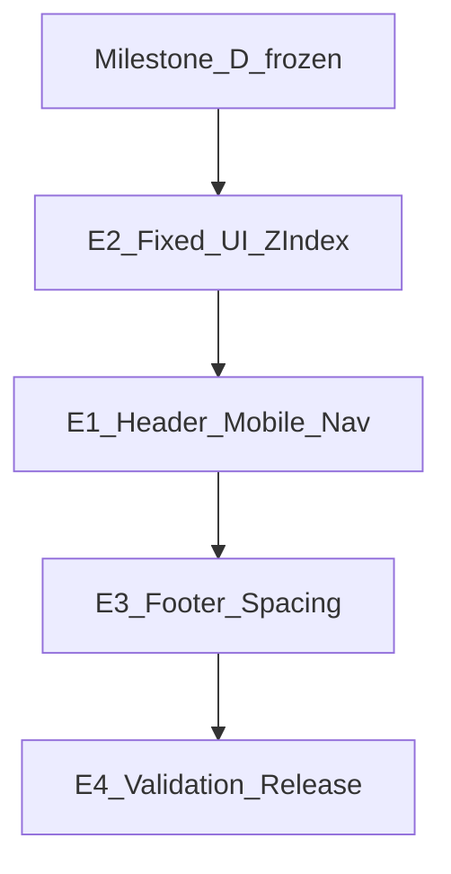

# Milestone E — Implementation Specification (FROZEN)

**Status:** **FROZEN** — definitive implementation specification  
**Do not implement** until this frozen plan receives an explicit implementation prompt  
**Prerequisite baseline:** Milestone D COMPLETE / tagged (2026-08-04)  
**Acceptance baseline:** `storefront-acceptance` `1af21d1` — 253 passed / 0 failed / 0 flaky / 272 skipped  
**Released packages:** storefront **0.8.0**, loop-card **1.6.1**, blocksy-child **1.1.0**  
**Target releases:** `biopentra-storefront` **0.9.0** (primary); `biopentra-blocksy-child` **1.2.0** only if sticky safe-area coexistence CSS is required; loop-card **unchanged**  
**Roadmap:** [ROADMAP.md](../ROADMAP.md) § Milestone E

---

## Milestone invariants

1. **Do not reopen** homepage/shop IA, canonical cards, image system, or PDP sticky-bar architecture (D2B JS/IO/sync stays; only coexistence CSS/tokens allowed).
2. **No checkout / gateway / cart AJAX behaviour changes.**
3. **SDS z-index contract is law** — values stay 100 / 200 / 300 / 400. Align third-party CSS to tokens; never escalate sticky/header above CookieYes with arbitrary z-index.
4. **No production replay** during Milestone E implementation. Dev-only until Milestone F / explicit approval.
5. **Test ladder:** targeted specs during work packages; one full `--milestone-e` run before tags; no accepted flakes.
6. **Database-backed changes** (Elementor 3782/3823, UMC, CookieYes) require backups, recorded option keys, idempotent CLI/export where practical, and documented replay/rollback — no undocumented manual-only steps.
7. Architecture changes to this frozen plan require product-owner approval before coding.



**Order rationale:** Live audit shows CookieYes and UMC floating switcher violate SDS and occupy the sticky purchase zone. Fix stack + currency placement before header Elementor polish.

---

## 1. Executive summary

Milestone E completes **global chrome polish** on mobile: touch targets, nav density, header search affordance, footer compaction, and fixed-UI coexistence (sticky bar + CookieYes + currency + mini-cart) on the frozen SDS stack.

| WP | Name | Primary owner |
|---|---|---|
| **E2** | Fixed UI + z-index coordination | storefront CSS + CookieYes settings + UMC settings |
| **E1** | Header + mobile navigation | Elementor header **3782** + storefront `header-auth` / megamenu CSS |
| **E3** | Footer + global spacing | Elementor footer **3823** + `footer-contact` + storefront chrome CSS |
| **E4** | Validation + release | `storefront-acceptance` + docs + tags |

### Locked decisions

1. **Currency (UMC) — verified API:** Live option `umc_settings.display.placement = sticky_footer` (CSS `.umc-switcher--floating-bottom`, `--umc-switcher-z-index: 9990`). Supported placements in installed Universal Multicurrency: `manual`, `floating_side`, `sticky_footer` (`SwitcherSettings::PLACEMENT_*`). **End state:** set `umc_settings.display.placement` to **`manual`**; insert **one** shortcode instance `[universal_multicurrency_switcher]` (primary; legacy alias `[umc_switcher]` also registered) into Elementor header **3782**; automatic floating injection must stop (no second instance). **Do not** use CSS `display:none` on the floating switcher as the permanent solution. Leave **WOOCS** and **`mp-woocs-browse-currency` inactive**.
2. **Z-index mapping** (values unchanged; see §2): banner/revisit → 300; CookieYes preference modal + blocking backdrop → 400; mini-cart drawer dialog/backdrop → 400; closed header/nav chrome → 200; Elementor popups / age-gate → 400.
3. **Header search (deterministic):** Compact **44×44** control in header 3782. If an approved commercial search input is present on the page, focus it and scroll it into view. Otherwise navigate to the WooCommerce **shop** page (canonical host of `[biopentra_shop_search]` / `#biopentra-shop-s`). No second search implementation; no duplicated predictive-search logic.
4. **Touch targets:** Menu toggle and account trigger ≥44×44 via storefront chrome CSS + Elementor padding (Elementor `--n-menu-toggle-icon-size:20px` today).
5. **Sticky bar:** PHP/JS architecture frozen; child CSS only for safe-area coexistence if storefront cannot solve alone.

---

## 2. SDS z-index contract and component mapping

| Layer | Token | Value |
|---|---|---|
| Sticky purchase bar | `--bp-z-sticky-bar` | 100 |
| Header / navigation chrome (closed) | `--bp-z-header` | 200 |
| Cookie consent banner / revisit | `--bp-z-cookie` | 300 |
| Overlays / modals | `--bp-z-overlay` | 400 |

| Component | Layer | Token |
|---|---|---|
| Sticky purchase bar (D2B) | Sticky | `--bp-z-sticky-bar` (100) |
| Closed header / nav / mega closed chrome | Header | `--bp-z-header` (200) |
| Ordinary CookieYes consent banner | Cookie | `--bp-z-cookie` (300) |
| CookieYes revisit / reopen control | Cookie | `--bp-z-cookie` (300) |
| CookieYes preference modal | Overlay | `--bp-z-overlay` (400) |
| CookieYes blocking backdrop | Overlay | `--bp-z-overlay` (400) |
| Mini-cart drawer dialog | Overlay | `--bp-z-overlay` (400) |
| Mini-cart backdrop | Overlay | `--bp-z-overlay` (400) |
| Elementor modal popups | Overlay | `--bp-z-overlay` (400) |
| Age-gate dialogs | Overlay | `--bp-z-overlay` (400) |
| Open mobile nav panel (if competing) | Header or Overlay | Prefer header when non-modal panel; overlay if full-screen modal — document choice in change record; stay within 200/400 |

**Rules:** Do not assign every CookieYes element to 300. Do not invent values above 400. Prefer storefront late CSS using `var(--bp-z-*)` after CookieYes custom CSS attempt.

---

## 3. Current-state ownership map

Audit evidence: `dev.biopentra.eu` @ 360×800 (logged-in admin bar present — validate logged-out). Horizontal overflow 0 on home.

| Surface | Live finding | Primary owner | Secondary |
|---|---|---|---|
| Site header | Elementor TB **#3782** sitewide; logo, Mega Menu, `biopentra_header_auth`, `woocommerce-menu-cart`; row z≈95 | Elementor 3782 | storefront CSS |
| Menu toggle | `.e-n-menu-toggle` 20×20 | Elementor | storefront chrome CSS |
| Account | `.biopentra-header-auth__trigger` h=20; CSS z=100000 | storefront `header-auth` | Elementor |
| Cart / mini-cart | Elementor Menu Cart + `.bp-mini-cart--drawer` | storefront `header-auth` | Elementor |
| Mega / Information | 3782 + `information-megamenu` (local z up to 9999) | Elementor + storefront | `cli-update-megamenu.php` |
| Header search | Absent | — (add in E1) | |
| Commercial search | `#biopentra-shop-s` (home/shop), `#biopentra-search-refine` (product search) | storefront shortcodes | page IA |
| Sticky purchase | `--bp-z-sticky-bar` 100; mobile-only | blocksy-child | frozen |
| CookieYes | `cookie-law-info` 3.5.3; banner z≈9999999; no repo CSS | CookieYes `cky_*` | storefront override |
| Currency | UMC `umc_settings.display.placement=sticky_footer`; z=9990 | universal-multicurrency | |
| WOOCS / mp-woocs | Installed **inactive** | leave inactive | |
| Footer | Elementor **#3823** (~1424px @360) | Elementor | `footer-contact` |
| Blocksy header/footer builders | Not used for chrome | — | |

---

## 4. E2 — Fixed UI and z-index coordination

### Goals
Align fixed layers to §2; eliminate bottom-viewport conflicts with sticky ATC; relocate currency permanently.

### UMC end state (unambiguous)

| Step | Action |
|---|---|
| 1 | Backup current `umc_settings` (export JSON in deployment record) |
| 2 | Set **`umc_settings.display.placement`** from **`sticky_footer`** → **`manual`** |
| 3 | Insert **one** Elementor shortcode widget in header **3782**: `[universal_multicurrency_switcher]` |
| 4 | Verify storefront shows **exactly one** `.umc-switcher` and **zero** `.umc-switcher--floating-bottom` |
| 5 | Leave WOOCS and `mp-woocs-browse-currency` inactive |

**Forbidden permanent fix:** hiding floating switcher with CSS while `placement` remains `sticky_footer`.

### Other implementation
1. Storefront chrome CSS mapping CookieYes banner/revisit → `--bp-z-cookie`; preference modal + backdrop → `--bp-z-overlay`.
2. Mini-cart drawer/backdrop → `--bp-z-overlay`; closed header-auth triggers → `--bp-z-header` (remove `z-index: 100000`).
3. Sticky coexistence without reopening sticky-bar.js; optional child safe-area only if required.
4. Document CookieYes option keys touched (`cky_*`) with before/after values.

### Exit criteria
- `placement=manual` in live options; one inline header switcher; no floating-bottom instance
- CookieYes banner ≤ cookie layer; preference modal on overlay layer
- Sticky ATC usable after cookie accept on mobile PDP

---

## 5. E1 — Header and mobile navigation

### Goals
≥44×44 primary controls; logo sizing; menu density; category access; focus order; no horizontal overflow; deterministic header search.

### Header search (frozen behaviour)

| Case | Behaviour |
|---|---|
| Page contains approved commercial search input | Focus that input and `scrollIntoView` (smooth optional). Prefer first match among `#biopentra-shop-s`, `#biopentra-search-refine` (visible). |
| Page lacks those inputs | Navigate to WooCommerce **shop** permalink (`wc_get_page_permalink( 'shop' )`), where `[biopentra_shop_search]` provides `#biopentra-shop-s`. Use a fragment (`#biopentra-shop-s`) or equivalent so the input is immediately available; preserve browser Back. |

**Constraints:** Accessible name (e.g. “Search products”); keyboard activatable; visible `:focus-visible`; **do not** fork predictive-search / live-search logic — reuse existing A/B markup only.

### Other implementation
1. Storefront `chrome-v1.css` (+ light JS for search control if needed) enqueued with 0.9.0.
2. Hit-areas for `.e-n-menu-toggle` and `.biopentra-header-auth__trigger`.
3. Elementor **3782** layout padding/gaps; insert search control + UMC shortcode (coordinate with E2).
4. Mobile menu open/close, focus, Escape; megamenu density; prefer WC archive links where editing Information mega (content in 3782).

### Exit criteria
- Menu + account ≥44×44 @ 360–430; no header overflow
- Search control matches frozen behaviour on home (focus) and PDP (navigate to shop)

---

## 6. E3 — Footer and global spacing

### Goals
Compact mobile footer (~1424px @360 today); crawlable legal/research links; touch-safe contact control.

### Implementation
1. Elementor **3823** mobile spacing / disclosures; keep real `<a href>` links in DOM.
2. Research-use text remains accessible (not `display:none`).
3. `footer-contact` ≥44×44.
4. Global chrome spacing via SDS tokens only.

### Exit criteria
- Materially shorter footer on 360–430; links crawlable; no overflow

---

## 7. Repeatable Elementor and settings changes

All DB-backed changes MUST include:

| Requirement | Detail |
|---|---|
| Pre-change backup | Export `_elementor_data` (+ related meta) for posts **3782** and **3823** under `docs/storefront-redesign/changes/backups/` (timestamped); export `umc_settings` JSON; export CookieYes options touched |
| Idempotent path | Prefer CLI patterned on `scripts/cli-update-megamenu.php` / setup-*-cli.php for header/footer patches; UMC via documented `wp option` update or admin UI with recorded keys |
| Exact keys | Record previous → new for `umc_settings.display.placement` (`sticky_footer` → `manual`) and each `cky_*` / Elementor meta change |
| Production replay | Step list in `deployment/milestone-E.md` (install ZIP → restore/apply CLI → set options → flush trio) — **not executed in E** |
| Rollback | Restore Elementor meta from backup; restore `umc_settings`; restore CookieYes options; previous plugin ZIPs |
| No undocumented manual-only steps | Screenshots allowed as evidence, not as sole procedure |

---

## 8. Validation strategy

### During implementation (targeted)

| WP | Specs | Viewports |
|---|---|---|
| E2 | `chrome-fixed-ui.spec.ts` (placement/manual, no floating-bottom, z-index layers, sticky after cookie); `pdp-sticky` smoke | mobile-360 (+390 if needed) |
| E1 | `chrome-header.spec.ts` (44×44, overflow, search focus vs shop navigate) | mobile-360/390/430 |
| E3 | Footer assertions in chrome specs | mobile-360 |

Extend `storefront-acceptance/tools/run-dev.sh` with `--e2-only`, `--e1-only`, `--e3-only`, `--milestone-e`.

### Full suite (exactly once before tag)

```bash
tools/run-dev.sh --milestone-e
```

Includes prior Milestone D specs plus E chrome specs. **Pass bar:** 0 failed, 0 flaky.

### Manual
Logged-out: 360 / 390 / 430 / 768 / 1440 — home, shop, search, WC archive, simple+variable PDP, cart, checkout (visual only), menu open, CookieYes banner+preferences, currency, mini-cart, footer.

---

## 9. Implementation order

1. **E2** — UMC `manual` + header shortcode + CookieYes/mini-cart z-index mapping  
2. **E1** — Header touch targets, frozen search control, menu density  
3. **E3** — Footer 3823 compaction + spacing  
4. **E4** — One `--milestone-e`, docs, bump/tag (no production)

---

## 10. Affected files and settings

| Area | Paths / settings |
|---|---|
| SDS tokens | `plugins/biopentra-storefront/assets/css/bp-tokens.css` (values unchanged) |
| Storefront chrome | New `assets/css/chrome-v1.css` (+ optional JS); `modules/header-auth/assets/header-auth.css`; mini-cart CSS |
| Sticky (optional) | `biopentra-blocksy-child/assets/pdp/sticky-bar.css` safe-area only |
| Elementor | Header **3782**, Footer **3823** |
| UMC | Option **`umc_settings`**: `display.placement` `sticky_footer` → **`manual`**; shortcode **`[universal_multicurrency_switcher]`** |
| CookieYes | Plugin `cookie-law-info`; `cky_*` options + custom CSS as needed |
| Acceptance | New chrome specs; `run-dev.sh` flags |
| Docs | This plan; `changes/milestone-E*.md`; `deployment/milestone-E.md`; `validation/milestone-E.md` |

**Not touched:** loop-card renderer, home/shop IA redesign, checkout behaviour, payment gateways, sticky-bar.js architecture.

---

## 11. Deployment strategy (dev)

1. Backups per §7  
2. Ship storefront 0.9.0 (bind-mount) + apply Elementor/UMC/CookieYes changes via recorded procedure  
3. Flush Elementor CSS + object cache + Cloudflare CSS purge  
4. Targeted then one `--milestone-e`  
5. Tag `storefront-v0.9.0` (+ child `v1.2.0` only if needed)  
6. **No production install**

---

## 12. Rollback strategy

| Layer | Action |
|---|---|
| Storefront | ZIP `storefront-v0.8.0` |
| Child (if bumped) | `v1.1.0` |
| Elementor | Restore 3782/3823 meta from §7 backups |
| UMC | Restore `umc_settings` (placement `sticky_footer` if rolling back E currency move) |
| CookieYes | Restore `cky_*` from backup |
| Caches | `wp elementor flush-css && wp cache flush` |

---

## 13. Estimated effort

| WP | Effort |
|---|---|
| E2 | 1–1.5 days |
| E1 | 1.5–2 days |
| E3 | 0.5–1 day |
| E4 | 0.5–1 day |
| **Total** | **~4–5.5 days** (Composer) |

---

## 14. Risks

| Risk | Mitigation |
|---|---|
| CookieYes inline !important | Late storefront CSS; never escalate sticky |
| Duplicate UMC (manual + leftover auto) | Verify `placement=manual` and single `.umc-switcher` |
| Elementor shortcode strips markup | Use Elementor shortcode widget; primary tag verified in UMC source |
| Footer disclosures hide links | Keep `<a href>` in DOM |
| Admin-bar skew | Validate logged-out |
| Suite flakes | D harness settles; 0 flaky bar |

---

## 15. Out of scope

- Milestone F / production replay  
- Homepage/shop IA redesign; canonical card changes; image-system reopen  
- Sticky-bar.js rewrite; checkout/payments  
- Reactivating WOOCS floating UI  
- Large new dependencies  

---

## 16. Documentation deliverables (during E execution)

- `changes/milestone-E2-fixed-ui.md`, `milestone-E1-header.md`, `milestone-E3-footer.md`  
- `deployment/milestone-E.md`, `validation/milestone-E.md`  
- Backups under `changes/backups/`  
- ROADMAP/README status updates at tag time  

---

## 17. Recommended first implementation task

After an explicit implementation prompt: **E2** — backup `umc_settings` + header 3782; set `display.placement` to `manual`; add `[universal_multicurrency_switcher]` to 3782; map CookieYes/mini-cart z-index per §2; run `--e2-only` + `pdp-sticky` smoke on mobile-360.

---

## Approval for execution

This document is **FROZEN**. Coding starts only on an explicit Milestone E implementation prompt.
