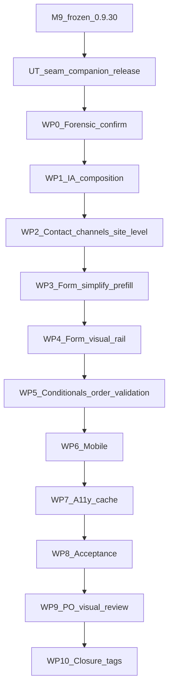
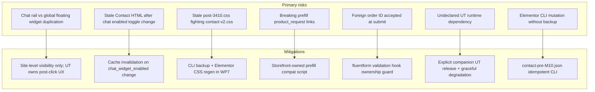
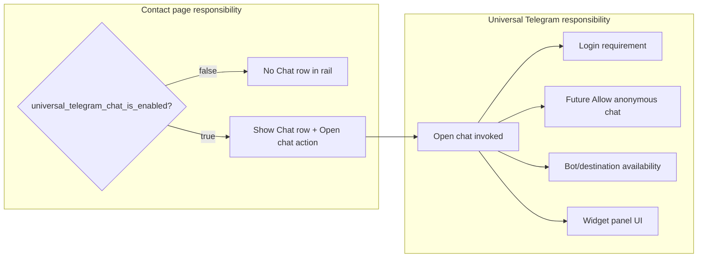

# M10 — Contact Page Experience Redesign (Frozen Plan)

**Status:** **PO-approved / frozen on DEV** (implementation complete; closure `storefront-v0.9.33`).
**Milestone identifier:** **M10** (M-track continues after frozen M9 / `storefront-v0.9.30`).
**Baseline:** M9 PO-approved / frozen on DEV (`CHANGELOG.md` `[0.9.30]`, tag `storefront-v0.9.30`). Repo at freeze: `main` at `4042877`. Storefront baseline tag: **`storefront-v0.9.32`**. Companion chat baseline: **`universal-telegram` `0.8.0`** (bind-mounted on DEV).
**PO final clarification (2026-08-22):** Contact-page Chat visibility depends **only** on site-level chat enabled state; all architectural PO decisions locked in §16.
**Convention of record (same as M8/M9):** plan at `docs/storefront-redesign/plans/MILESTONE_M10_*.md`; closure via `CHANGELOG.md` + tag `storefront-v{ver}`; acceptance `tests/m10-*.spec.ts`. Do **not** treat stale redesign-repo `STATUS.md`/`ROADMAP.md` as authority.



---

## Milestone invariants (PO-locked)

1. **Hero frozen** — no hero redesign; only minimal spacing seam below hero if required by new layout below.
2. **Bottom band `fff6430` removed** — redundant “Can’t find…” / Request product CTA.
3. **Mode cards removed** — Contact + Request product cards and Continue buttons; **Reason for contact** is the sole mode switch.
4. **`?prefill=product_request` preserved** — moved from Elementor inline HTML widget to maintainable Storefront ownership.
5. **Supporting rail subordinate** — editorial/typographic; not an equal white bordered card competing with the form.
6. **Chat visibility = site-level enabled only** — Contact page does **not** inspect login state or future anonymous-chat eligibility.
7. **Order submit validation in scope** — narrow `wc_related_order` ownership guard at submit time.
8. **No production replay** in M10 — DEV only until separate PO GO.
9. **M1–M9 remain frozen** — no regressions to header, footer, shop, homepage M1–M7 sections.
10. **Motion & Interaction Polish** remains deferred and unnumbered.

---

## 1. Forensic findings (22 required questions)

| # | Question | Finding |
|---|----------|---------|
| 1 | Contact page ID / Elementor ownership | **Page ID `3410`**, slug `/contact/`, Elementor builder page. Root container `a3a80db`. Blocksy hero disabled. |
| 2 | Hero node/widget IDs | Band **`ef97090`** → row `de51377` → text col `756c3f9`: eyebrow `caed175`, h1 `f3e8da2`, intro `55b041d`. Empty right col `ea8ceac`. BG overlay media **3901** (`policy_hero.webp`). **Frozen — no redesign.** |
| 3 | Quick response panel IDs | Sidebar col **`733fa02`** → card **`3ecdd8b`**: heading `f156d66`, copy `1a221d3`, Telegram `7fd3919`/`090033a`, Open Telegram `ee297b5`, **self-ref Contact form `a8f3c21`**, EU `d601157`/`796eff4`, research box `764a9b5`/`269c584`. **Replace with subordinate editorial rail.** |
| 4 | Form node/widget IDs | Form anchor col **`51c4ced`** (`_element_id: contact-form`) → card **`274a45c`**: heading `1126963`, intro `1a019e3`, **mode-card row `123d679`** (**remove**), prefill HTML `d3307cf` (**remove → storefront**), Fluent widget **`646ab51`** (form #5), privacy `8427aa7`. **Bottom band `fff6430` — remove (PO-locked).** |
| 5 | Form PHP/shortcode ownership | Fluent Forms **#5** via Elementor Pro widget. Option `biopentra_inbox_contact_form_id=5`. Order dropdown: **mu-plugin** `biopentra-fluentform-contact-orders.php`. Tickets: **`fluent-imap-support-desk`**. |
| 6 | CSS ownership | No contact-specific storefront CSS today. Per-page Elementor `post-3410.css`. M10 adds scoped `contact-v2.css`. |
| 7 | JS ownership | Fluent `form-submission.js`. Inline prefill in Elementor `d3307cf` → **move to storefront `contact-v2.js`**. Chat: `universal-telegram/assets/js/chat-widget.js`. |
| 8 | Submission endpoint/backend | Fluent AJAX → `fluentform/submission_inserted` → **`Biopentra_Contact_Inbox_Fluent_Ticket_Bridge`** → inbox tickets. Same-page confirmation, hide form. |
| 9 | Validation / security / anti-spam | Fluent required fields; global Akismet + CleanTalk mark-as-spam; Fluent AJAX nonce. **M10 adds submit-time `wc_related_order` ownership validation.** |
| 10 | Reason field source / values | `general_question`, `shipping_question`, `order_issue`, `payment_question`, `product_request`, `other`. |
| 11 | Product request conditional | `requested_product` shown when `reason_for_contact = product_request`. |
| 12 | Related order conditional | `wc_related_order` shown when `reason_for_contact = order_issue`. Options from mu-plugin filter. |
| 13 | Logged-out vs logged-in (form) | Logged out: order select shows login placeholder. Logged in: ≤40 orders for `customer_id = get_current_user_id()`. **Chat login requirement is UT-owned after Open chat — not Contact-page visibility.** |
| 14 | Order authorization / data source | Render-time: `wc_get_orders(['customer_id' => current user])`. **Submit-time: no validation today — M10 adds ownership guard.** |
| 15 | Chat plugin ownership | **`universal-telegram`** (`dev/universal-telegram`, bind-mounted, v0.8.0). |
| 16 | Authoritative chat **enabled** state | Admin toggle `universal_telegram_settings.chat_widget_enabled`. Full runtime availability (`ChatWidgetAvailability::is_available()` — bot + destination) is **UT-owned after Open chat**, not Contact-page visibility input. |
| 17 | Open chat programmatically | **No public API today.** M10 requires supported UT seam (documented event or small public JS API). **Do not adopt `.ut-chat-widget__toggle` click as long-term cross-plugin contract.** |
| 18 | Telegram ownership/link | Static `https://t.me/biopentra` in Elementor `ee297b5` + M8 footer `092e844`. |
| 19 | Acceptance coverage today | Baseline overflow + M8 footer `/contact/` CTA. **No dedicated contact UX spec.** |
| 20 | M8 footer-contact decoupling | Footer email machinery removed in M8. Contact page is primary contact surface with footer CTA/Telegram. |
| 21 | Full-page cache / conditional UI | Anonymous `/contact/` cache-eligible. **`wordpress_logged_in_*` bypasses** cache for logged-in order dropdown. **Chat rail visibility is site-level — safe in anonymous cached HTML; no per-user cache fragmentation for chat.** Invalidate cache when site-level chat enabled setting changes. |
| 22 | Stale Elementor page CSS | `post-3410.css` encodes removed widgets. Regenerate after CLI mutation; scope `contact-v2.css` under `body.bp-contact-m10`. |

---

## 2. Architectural risks



- **Chat duplication:** Global floating widget unchanged; Contact rail is a contextual shortcut when chat is **site-enabled**, not a second widget implementation.
- **Login vs visibility:** Contact page **never** hides Chat because visitor is anonymous. UT handles sign-in (today) and future “Allow anonymous chat” (out of M10 scope) after Open chat.
- **Storefront must not duplicate** future anonymous-chat eligibility logic — acceptance asserts this.
- **Header/footer regression:** Re-run `m8-footer.spec.ts`, `baseline.spec.ts`, sample `m1-header` / `chrome-header`.

---

## 3. Recommended desktop composition (≥1025)

**Hero `ef97090` frozen** — spacing seam below only if layout requires.

```text
┌──────────────────────────────────────────────────────────────┐
│ HERO (FROZEN): CONTACT / We're here to help / intro          │
└──────────────────────────────────────────────────────────────┘
┌──────────────────────────────────────────────────────────────┐
│ max-width ~920–1040 centered band                            │
│  ┌──────────────────┐  ┌─────────────────────────────────┐ │
│  │ SUPPORT RAIL ~32%│  │ PRIMARY FORM ~68% (dominant)    │ │
│  │ editorial/typo   │  │ Send us a message                 │ │
│  │ Ways to reach us │  │ Reason for contact (prominent)   │ │
│  │ [Chat] if enabled│  │ Name / Email / conditional fields│ │
│  │ Telegram         │  │ Message                          │ │
│  │ response / EU    │  │ Submit (strong primary)          │ │
│  │ research (muted) │  │ Privacy line                     │ │
│  └──────────────────┘  └─────────────────────────────────┘ │
└──────────────────────────────────────────────────────────────┘
│ GLOBAL M8 FOOTER                                              │
```

**Removed (PO-locked):** Quick response card pattern, self-ref `#contact-form` button, mode cards `123d679`, Elementor prefill widget `d3307cf`, bottom band **`fff6430`**.

**Visual intent:** Form surface dominant (`274a45c`). Rail **subordinate** — no equal white bordered card; typography-led, muted surfaces.

---

## 4. Recommended mobile composition (390-first)

```text
HERO (frozen, compact)
→ Compact "Ways to reach us" strip (≥44px targets)
   • Chat if site-enabled (anonymous + logged-in)
   • Telegram external link
→ Form immediately (dominant)
→ Footer
```

- No tall pre-form card stack. EU/research as muted copy, not a second panel.
- Mode cards absent; reason `<select>` primary control after heading.

---

## 5. Chat visibility architecture

### Site-level visibility rule (PO-locked)

**Contact page shows Chat when and only when chat is enabled for the site.**

| Site-level chat enabled? | Contact page Chat row | After Open chat |
|--------------------------|----------------------|-----------------|
| **NO** | Absent (anonymous and logged-in) | — |
| **YES** | **Visible for everyone** (anonymous and logged-in) | **Universal Telegram owns all further behavior** |

**Contact page does NOT inspect:**

- `is_user_logged_in()`
- Future “Allow anonymous chat” setting (default OFF, out of M10)
- Bot/destination backend availability (`ChatWidgetAvailability::is_available()`)
- Conversation REST eligibility

**Universal Telegram remains authoritative for:**

- Login requirement after Open chat (today)
- Future anonymous eligibility
- Backend availability and error UI (e.g. “Chat is currently unavailable”)
- Sign-in panel vs active chat UI



### Public Universal Telegram seam (PO-locked)

**PHP — site-level only:**

```php
universal_telegram_chat_is_enabled(): bool
```

- Answers: **“Is chat enabled for this site?”** (admin `chat_widget_enabled` toggle in `universal_telegram_settings`).
- Does **not** answer visitor eligibility, login state, or backend readiness.
- Registered in `universal-telegram-functions.php` following existing `universal_telegram_emit_event()` precedent.
- **Graceful degradation:** if function missing or UT inactive, Storefront treats as disabled — **no fatal**, Chat row omitted.

**JS — supported Open Chat integration (not DOM click contract):**

- Implementation selects seam shape after inspecting UT architecture: `CustomEvent`, small public JS API, or equivalently clean supported contract.
- **Locked requirements:** documented cross-plugin seam; automated coverage; Storefront invokes **only** this seam for “Open chat” buttons.
- **Do not** use `.ut-chat-widget__toggle` programmatic click as the long-term cross-plugin API.

### Storefront integration

1. **`[biopentra_contact_channels]`** shortcode — calls `universal_telegram_chat_is_enabled()` only; renders Chat row when true; **never** checks login.
2. **`contact-v2.js`** — Open chat via UT JS seam only.
3. **No Chat authentication/eligibility UI** on Contact page.

### Future “Allow anonymous chat” (explicitly OUT OF SCOPE for M10)

- UT will add setting; Contact page remains compatible automatically because visibility does not depend on it.
- Acceptance: assert Storefront source does not reference anonymous-chat eligibility settings.

---

## 6. Cache model

**Chat visibility simplification:** Because Contact-page Chat depends only on **site-level** enabled state (identical for all anonymous visitors), **no per-user cache fragmentation** is required for Chat rail visibility.

| Concern | Behavior |
|---------|----------|
| Anonymous Contact HTML | Cache-eligible; Chat row present when site chat enabled, absent when disabled — **same for all anonymous visitors** |
| Logged-in order dropdown | Protected by **`wordpress_logged_in_*` full-page-cache bypass** (existing policy) |
| Order data leak | Anonymous cached HTML must not contain user-specific order options; logged-in bypass ensures per-user order lists |
| Chat setting change | When `chat_widget_enabled` changes, **stale Contact HTML must not persist indefinitely** — invalidate via `dev-clear-cache.sh` as part of UT settings save hook or documented ops step (WP7). Optional: UT settings save fires cache purge if F2 tooling is active |
| Per-user chat visibility | **Not used** — do not introduce Vary or per-auth cache keys for Contact Chat row |

---

## 7. Simplified form interaction model (PO-locked)

| Reason | UX |
|--------|-----|
| General question | Standard fields |
| Shipping question | Standard; optional helper copy (implementation may omit initially — see §16) |
| Order issue | `wc_related_order` conditional. Logged-out: login placeholder. Logged-in: user's orders (≤40). |
| Payment question | Standard |
| Product request | `requested_product` conditional |
| Other | Standard |

**Removed (PO-locked):** Mode cards `6da33c9`, `af62b69`, Continue buttons `ee4d666`, `48bbd56`, bottom band `fff6430`, Elementor prefill widget `d3307cf`.

**Prefill compat (PO-locked — preserve):** Storefront `contact-v2.js` (or PHP-init) reads `?prefill=product_request`, sets `reason_for_contact`, dispatches change — **do not break existing links**.

**Do not change:** Fluent form #5 field names, conditionals, or ticket bridge field keys.

---

## 8. Order ownership validation (M10 security correctness)

**Scope:** Narrow submit-time guard for `wc_related_order` — not a new product feature.

When `wc_related_order` is submitted (non-empty):

1. Require authenticated user (reject/clear if guest).
2. Verify order ID references a WooCommerce order where `customer_id === get_current_user_id()`.
3. Use cleanest Fluent Forms mechanism: `fluentform/validation_error` or `fluentform/before_insert_submission` filtered to form #5 / field name `wc_related_order`.
4. On invalid foreign ID: validation error (user-visible, accessible) — do not expose other order data.
5. Empty optional selection remains valid.

**Ownership:** Extend **mu-plugin** `biopentra-fluentform-contact-orders.php` (same form ownership) or adjacent storefront helper — **not** duplicate logic in Elementor.

**Must not alter** valid order submission behavior for the order owner.

---

## 9. Implementation ownership

| Layer | Owner | M10 responsibility |
|-------|-------|-------------------|
| **Companion: `universal-telegram`** | UT repo | `universal_telegram_chat_is_enabled()` + Open Chat JS seam; version bump; tests; release per UT conventions |
| Elementor page 3410 | Storefront CLI | Structure; remove locked redundancies; embed `[biopentra_contact_channels]`; keep `646ab51`; hero frozen |
| Storefront CSS | `contact-v2.css` | Subordinate rail + dominant form; 1024/1025 |
| Storefront PHP | `contact-v2-helpers.php` | Shortcode, body class `bp-contact-m10`, prefill compat |
| Storefront JS | `contact-v2.js` | Open chat via UT seam; prefill handler |
| Order validation | mu-plugin (preferred) | Submit-time `wc_related_order` ownership |
| Form backend | Fluent #5 + fluent-imap-support-desk | Field keys unchanged; validation hook added |
| Acceptance | `m10-contact.spec.ts` | Matrix §13 |
| Docs / closure | Both repos if UT changed | Closure docs + tags |

**Design tokens:** `bp-tokens.css`, M-track palette, 1024/1025 breakpoint.

---

## 10. Cross-repository release sequencing (PO-locked)

If M10 requires UT changes, treat as **explicit companion release** — no silent runtime dependency.

**Order:**

1. **Universal Telegram** — implement and test `universal_telegram_chat_is_enabled()` + Open Chat JS seam; bump version (e.g. `0.8.1` or `0.9.0` per UT semver); prepare release per `dev/universal-telegram` conventions.
2. **Deploy UT to DEV** — bind-mount already active; verify helpers on DEV.
3. **Storefront** — integrate shortcode/JS against seam; **graceful degradation** if function absent (no fatal, omit Chat row).
4. **Integration test on DEV** — anonymous + logged-in, chat enabled/disabled toggles.
5. **Closure** — record **both** versions/tags if both repos changed:
   - `storefront-v{version}` on `biopentra-custom-plugins`
   - UT tag on `universal-telegram` repo (per that repo's tagging convention)

**Storefront must not fatal** if companion seam is absent (older UT deployed).

---

## 11. Development version / closure workflow (PO-locked)

Align with M8/M9 storefront practice:

| Phase | Action |
|-------|--------|
| **Implementation** | Bump to untagged DEV version (e.g. `0.9.33`) during work; deploy/test on DEV; screenshots |
| **Corrective** | Additional dev patch bump if PO review requires fixes |
| **Closure (after explicit PO approval)** | Closure docs; final CHANGELOG entries; **freeze tags** (`storefront-v{version}` + UT tag if applicable); push |

Do **not** postpone all version bumps until closure if repo convention normally bumps during DEV implementation (as M8/M9 did for intermediate dev versions).

---

## 12. Work packages

- **UT (pre-WP2):** `universal_telegram_chat_is_enabled()` + Open Chat JS seam + UT tests + DEV deploy.
- **WP0** — Forensic re-confirm; verify seam contract.
- **WP1** — CLI backup; asymmetric layout; remove `fff6430`; hero frozen; subordinate rail structure.
- **WP2** — `[biopentra_contact_channels]` using site-level helper only; Telegram unchanged; no login visibility logic.
- **WP3** — Remove mode cards; storefront `?prefill=product_request` compat; remove Elementor prefill widget.
- **WP4** — `contact-v2.css`: dominant form, editorial rail (not equal card).
- **WP5** — Conditional field verification + **submit-time order ownership validation**.
- **WP6** — 390-first mobile; Chat visible when site-enabled for anonymous too.
- **WP7** — A11y; cache invalidation on chat toggle change; order dropdown bypass audit; Elementor CSS regen.
- **WP8** — `m10-contact.spec.ts`, `--m10-only`, regressions.
- **WP9** — PO visual review screenshots (rail typography, any new copy).
- **WP10** — Closure docs + final tags (both repos if applicable).

---

## 13. Acceptance matrix

**Harness:** 8 viewports (360, 390, 430, 768, 1024, 1025, 1440, 1680).  
**Command:** `bash dev/storefront-acceptance/tools/run-dev.sh --m10-only`

| Scenario | Assertions |
|----------|------------|
| **Anonymous, Chat globally disabled** | No Chat row in rail; Telegram works; no mode cards; no `fff6430` |
| **Anonymous, Chat globally enabled** | **Chat row visible**; Open chat invokes UT seam (widget panel or sign-in UI — UT-owned); **Contact page does not hide Chat because visitor is anonymous** |
| **Logged in, Chat globally disabled** | No Chat row |
| **Logged in, Chat globally enabled** | Chat row visible; Open chat works via UT seam |
| **Future Allow anonymous chat** | **Out of M10 scope**; assert Storefront does **not** duplicate anonymous-chat eligibility logic (grep/static check on storefront contact modules) |
| Anonymous, general question | Reason select visible; no `requested_product` / `wc_related_order` until selected |
| Anonymous, product request reason | `requested_product` visible after select change |
| Anonymous, order issue reason | `wc_related_order` visible; login placeholder text |
| `?prefill=product_request` | Reason pre-selected to product request (storefront-owned script) |
| Logged in, order issue + orders | Order select populated with user's orders only |
| Logged in, order issue, no orders | Select without other users' data |
| Logged in, product request | `requested_product` visible |
| **Submit foreign order ID** | Rejected with validation error (security test) |
| Responsive all viewports | No self-ref Contact form button; no mode cards; no `fff6430`; ≥44px targets; no horizontal overflow; 1024/1025 boundary |
| Regression | `m8-footer.spec.ts`, `baseline.spec.ts`, header sample |

**Auth tests:** Disposable customer + storageState fixture as needed.

---

## 14. Rollback strategy

1. Restore `contact-pre-M10.json` to page 3410.
2. `git checkout storefront-v0.9.32 -- plugins/biopentra-storefront/` (+ revert mu-plugin validation if committed separately).
3. Revert UT seam commit / redeploy prior UT version if companion released.
4. Clear Elementor CSS + `dev-clear-cache.sh`.
5. Disable/remove `m10-contact.spec.ts` after rollback confirmed.

---

## 15. Production replay outline (OUT OF SCOPE)

After separate PO GO: deploy Release ZIPs (storefront + UT if changed), run CLI on prod Contact page ID, clear cache, run `--m10-only` against prod/staging, PO sign-off.

---

## 16. PO decisions — all architectural decisions locked

### Locked PO decisions (complete — no further architecture gates)

| Decision | Resolution |
|----------|------------|
| Chat visibility | **Site-level enabled only** — show for anonymous and logged-in when enabled |
| Bottom band `fff6430` | **Remove** |
| Mode cards | **Remove**; reason select sole mode switch |
| `?prefill=product_request` | **Preserve**; storefront-owned |
| Hero | **Frozen**; minimal seam spacing only |
| Supporting rail | **Subordinate editorial**; not equal white card |
| Chat open seam | **Supported/documented UT cross-plugin seam**; not `.ut-chat-widget__toggle` as long-term contract; graceful degradation; automated coverage; UT owns post-click auth/eligibility/UI |
| Order submit validation | **In scope** for M10 |
| Cross-repo release | **Explicit companion UT release** if seam added |
| DEV version workflow | Bump during implementation; tag at closure |
| Future Allow anonymous chat | **Out of M10 scope**; Contact page must not duplicate eligibility logic |

### No remaining architectural PO decisions

All architectural and product-owner decisions required before implementation are **locked**. Implementation may proceed under separate explicit authorization without further PO architecture approval.

The following are **implementation decisions** (resolved during build; surfaced at WP9 visual review where customer-facing):

| Topic | Implementation authority |
|-------|-------------------------|
| **UT Open Chat seam shape** | Implementation chooses `CustomEvent`, small public JS API, or equivalently clean supported contract after inspecting Universal Telegram architecture. Locked requirements: supported/documented cross-plugin seam; no `.ut-chat-widget__toggle` manipulation as long-term contract; graceful degradation; automated coverage; Universal Telegram owns post-click authentication/eligibility/UI. |
| **Rail typography and spacing** | Implementation detail within approved subordinate editorial direction. Resolve during WP4/WP6; present at PO visual-review gate (WP9). |
| **Optional per-reason helper copy** | Implementation may omit initially unless it clearly improves comprehension without adding clutter or changing meaning. Any new substantive customer-facing copy surfaced during PO visual review (WP9). |

---

## 17. Expected files to change (implementation phase)

**`universal-telegram` (companion)**

- `universal-telegram-functions.php` — `universal_telegram_chat_is_enabled()`
- `assets/js/chat-widget.js` — Open Chat seam listener/API
- `tests/` — helper + open seam coverage
- Version bump + CHANGELOG + tag

**`biopentra-custom-plugins` (storefront)**

- `docs/storefront-redesign/changes/backups/contact-pre-M10.json`
- `docs/storefront-redesign/changes/m10-contact-page.md`
- `plugins/biopentra-storefront/scripts/setup-m10-contact-page-cli.php`
- `plugins/biopentra-storefront/assets/css/contact-v2.css`
- `plugins/biopentra-storefront/includes/contact-v2-assets.php`
- `plugins/biopentra-storefront/includes/contact-v2-helpers.php`
- `plugins/biopentra-storefront/assets/js/contact-v2.js`
- `plugins/biopentra-storefront/biopentra-storefront.php` (DEV bump during work)
- `plugins/biopentra-storefront/includes/class-biopentra-storefront.php`
- `data/wordpress/html/wp-content/mu-plugins/biopentra-fluentform-contact-orders.php` (submit validation)
- `dev/storefront-acceptance/tests/m10-contact.spec.ts`
- `dev/storefront-acceptance/tools/run-dev.sh` (`--m10-only`)
- `CHANGELOG.md` (closure)

**Not touched:** Production; M1–M9 frozen templates (except Contact 3410); Fluent #5 field keys; Telegram bot config; Motion backlog.

---

## 18. Freeze baseline verification

| Check | Value at documentation freeze |
|-------|-------------------------------|
| Repo | `biopentra-custom-plugins` `main` |
| Pre-freeze commit | `4042877` |
| Storefront tag baseline | `storefront-v0.9.32` (`0.9.32`) |
| Universal Telegram baseline | `0.8.0` (bind-mounted on DEV) |
| M9 frozen | `storefront-v0.9.30` |
| Production | Untouched |
| Implementation | **Not started** |
