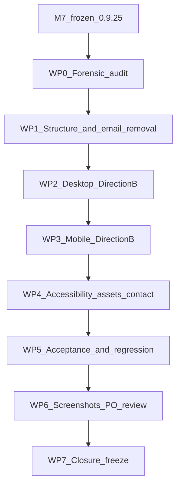

# Milestone M8 — Global Footer Redesign — Implementation Specification (FROZEN)

**Status:** **FROZEN** — definitive implementation specification. Documentation-only freeze; **no implementation has occurred**.
**Do not implement** until this frozen plan receives an explicit implementation prompt.
**Prerequisite baseline:** M7 PO-approved / frozen on DEV — `storefront-v0.9.25` (commit `39883dd`).
**Design baseline:** Direction B (dark/structured endpoint), desktop + mobile, PO-selected. Design canvas: [https://claude.ai/code/artifact/38449480-6481-429e-90aa-5041183eed84](https://claude.ai/code/artifact/38449480-6481-429e-90aa-5041183eed84).
**Target release:** `biopentra-storefront` next patch/minor after `0.9.25` (exact version decided at tag time; **not bumped by this freeze**).
**Roadmap of record:** `CHANGELOG.md` (repo root) — see note in §0 on why this plan does not live under, or update, `docs/storefront-redesign/ROADMAP.md`/`README.md`.

---

## 0. Milestone numbering and documentation-convention forensics

Two separate milestone tracks exist in this repository:

1. **Legacy lettered track (0, A–E, P0/F)** — governed by `docs/storefront-redesign/ROADMAP.md` and `README.md`, with per-milestone specs in `docs/storefront-redesign/plans/MILESTONE_*.md`. This track's own **Milestone E** already touched the footer once (E3, footer mobile spacing compaction, shipped in `storefront-v0.9.0`). This track ends at P0 (production rollout, "playbook ready", not executed).
2. **Numbered "M" track (M1–M7)** — the *active* track this footer work continues. Verified via `git log`: `M1` frozen at `storefront-v0.9.14` through `M7` frozen at `storefront-v0.9.25` (commits `3a1eae7` … `39883dd`). This track has **no dedicated ROADMAP.md/STATUS.md** — its system of record is **`CHANGELOG.md`** (Keep a Changelog format, root of `biopentra-custom-plugins`) plus git tags `storefront-v{version}` and per-milestone Playwright specs `tests/m{N}-*.spec.ts` in the sibling `storefront-acceptance` repo.

**Conclusion:** the next milestone in the active track is **M8**, confirmed (not assumed) by the M1–M7 tag sequence. Per this repo's actual convention (not a generic STATUS.md/ROADMAP.md pair, which do not exist for this track):

- This frozen plan lives at `docs/storefront-redesign/plans/MILESTONE_M8_GLOBAL_FOOTER_REDESIGN.md` — matching the existing `MILESTONE_D_IMPLEMENTATION.md` / `MILESTONE_E_IMPLEMENTATION.md` naming precedent, since M8 is a multi-work-package milestone of comparable weight.
- The "STATUS/ROADMAP" update this freeze requires is an **`[Unreleased]` entry in `CHANGELOG.md`**, following the exact pattern already used there for M1–M7 (`### Planned` under `## [Unreleased]`). The legacy `docs/storefront-redesign/ROADMAP.md`/`README.md` are **not** touched — they document a different, already-superseded track and already show their own footer milestone (E3) as shipped; editing them for M8 would misattribute this work to the wrong track.

---

## Milestone invariants

1. **Direction B (dark/structured) is frozen for both desktop and mobile.** Do not reopen the visual-direction decision or implement Direction A.
2. **No M1–M7 regressions.** M7 (`.bp-m7-guidance__*` in `home-v2.css`) and all earlier M-track work are read-only boundaries; only the minimal footer-adjacent handoff (spacing at the M7 → footer seam) may be touched, and only if unavoidable.
3. **Email is removed, not hidden.** No CSS-only suppression of the existing footer email machinery — the obsolete DOM/PHP/JS/image path is architecturally removed from the footer (see §9), scoped strictly to what forensics in §2 confirms is footer-only and has zero other callers.
4. **No new visual polish beyond the approved mockup's proportions.** The Direction B artifact (desktop + mobile) is the baseline; do not add ornamentation "because implementation begins."
5. **Canonical assets only.** Logo: reuse the existing `theme-site-logo` Elementor dynamic widget already wired into template 3823 (no ad-hoc duplicate asset). Payment marks: the four real SVGs already referenced in template 3823 (no swap needed — see §2).
6. **Breakpoint convention:** desktop/mobile split at **1024/1025**, matching `bp-tokens.css` (`--bp-bp-lg: 1024px`) and the M1–M7 CSS convention (`home-v2.css`, `bp-header-m1.css` — `max-width:1024px` / `min-width:1025px`), **not** the older `chrome-v1.css` E3 footer rule (`max-width:767px`), which this milestone supersedes for footer-scoped selectors only.
7. **No checkout/account/header/unrelated-page changes.** Footer (template 3823) only.
8. **Database-backed Elementor changes require an idempotent CLI** (pattern: `setup-milestone-e-footer-cli.php`), a pre-change backup, and documented rollback — no undocumented manual-only Elementor edits.
9. **No production replay.** DEV-only until explicit PO GO (§17).
10. Architecture changes to this frozen plan require product-owner approval before coding.



---

## 1. Executive objective

Replace the current light, four-column, plaintext-email global footer (Elementor Theme Builder template **3823**) with the PO-approved **Direction B — dark/structured endpoint** composition, on desktop and on a purpose-built ~390px mobile layout, with the footer email machinery architecturally removed (not hidden), real canonical logo and payment assets, and no regression to the frozen M1–M7 homepage or to any other page that renders this global footer.

---

## 2. Current-state forensic findings

Verified directly against the running DEV Elementor document (`wp post meta get 3823 _elementor_data`), the active plugin (`wp plugin list --status=active`), and the filesystem — not assumed from the design-exploration prompt.

### 2.1 Elementor structure (template 3823)

```
782cf0a  container (root, column, padding 48/32 → 16/12 mobile)
├─ 77baf59  container (row, boxed 1200px)  ── "link/contact band"
│  ├─ 90e7b9a  container (28% width)        ── BRAND column
│  │  ├─ b869098  widget: theme-site-logo   ── dynamic, pulls WP Customizer Site Logo
│  │  └─ 0ffe789  widget: text-editor       ── brand description (two <p>, "bp-ft-v2-brand[-secondary]")
│  ├─ 5a08358  container                    ── INFORMATION column
│  │  ├─ 4ced69d → 7ce7254 (icon) + 467379b (heading "Information")
│  │  └─ 696f38d  widget: html              ── <nav><ul> About/FAQ/Shipping/Refund/**Contact** (5 links)
│  ├─ 537f779  container                    ── LEGAL column
│  │  ├─ e15aa02 → 07dab42 (icon) + 7721961 (heading "Legal")
│  │  └─ 09ad996  widget: html              ── <nav><ul> Terms/Privacy/Cookie/Research Disclaimer (4 links)
│  └─ f352048  container                    ── CONTACT column
│     ├─ cae4044 → c47b482 (icon) + 0970f54 (heading "Contact")
│     ├─ f6906c1  widget: shortcode         ── [biopentra_footer_email]  ← EMAIL MACHINERY
│     └─ 092e844  widget: text-editor       ── Telegram line (<a href="https://t.me/biopentra">@biopentra</a>)
└─ cf46e8f  container                       ── UTILITY/BOTTOM band
   ├─ 24736b6  container
   │  ├─ payLabel3823  widget: text-editor  ── "Secure payment options"
   │  └─ payLogos3823  widget: html         ── 4×  real payment SVGs (see 2.3)
   └─ e5be984  widget: text-editor          ── copyright + research-use line
```

Legal link slugs (verified, not assumed): `/terms-and-conditions/`, `/privacy-policy/`, `/cookie-policy/`, `/research-use-disclaimer/` (note: **not** `/research-disclaimer/`).

Existing mobile compaction lives in `chrome-v1.css` (`@media (max-width:767px)`), keyed to these exact element IDs via Elementor's auto-generated `.elementor-element-{id}` classes — this is the established technique for ID-scoped footer CSS beyond Elementor's own per-widget responsive controls, and M8 continues it (new breakpoint, new file — see §10).

### 2.2 Email machinery — exact scope (safe-removal boundary)

`[biopentra_footer_email]` is registered by **`Biopentra_Storefront_Footer_Contact_Module`** (`plugins/biopentra-storefront/modules/footer-contact/class-footer-contact-module.php`), part of the **active** `biopentra-storefront` plugin (`0.9.25`). It renders a JS-built mailto button (`assets/footer-contact/footer-contact-email.js`, handle `biopentra-footer-contact-email`) wrapping an `` of the email address (`assets/footer-contact/bp-e1.png`), plus a `noindex` filter keyed to post meta `_biopentra_placeholder_page`.

Verified ownership and blast radius:

- **Only active caller:** grep across `plugins/` finds the shortcode/script/image/class used **only** inside `modules/footer-contact/` and referenced **only** by Elementor widget `f6906c1` in template 3823. No other template, page, or module calls it.
- **Legacy `biopentra-footer-contact` plugin** is on disk but **inactive** (`wp plugin list --status=active` does not list it) and contains only a `README.md` stub (no code) — confirmed via the README's own "Retired storefront-module stubs" table. Zero shared-runtime risk.
- **`_biopentra_placeholder_page` post meta**: referenced in PHP **only** by this same module; a live DB query (`SELECT post_id FROM wp_postmeta WHERE meta_key='_biopentra_placeholder_page'`) returned **zero rows**. This sub-feature is dead code with no data dependency.

**Conclusion:** the entire `modules/footer-contact/` surface (class, JS, image, shortcode, robots filter) is footer-only, single-plugin-owned, and has no other DOM/DB caller. It is safe to remove architecturally, not just hide — see §9.

### 2.3 Payment assets — already correct, no swap needed

`payLogos3823` already renders the four **real** SVGs from `wp-content/uploads/2026/05/` (not placeholder text — this corrects an assumption in the design-exploration prompt):

```html


```

These are copies of the same source files at `plugins/biopentra-storefront/modules/header-auth/assets/images/{Bitcoin-Cryptocurrency,Usdc-Cryptocurrency,Visa-logo,Mastercard-logo}.svg`. **No new asset work is required** — M8 only needs a restrained light-chip wrapper (CSS) around these existing `` tags so all four remain legible on the dark ground (Mastercard's SVG contains a `#000000` wordmark portion that is illegible directly on `#0f1f33`; Bitcoin/USDC/Visa are full-color and legible either way, but a shared chip treatment keeps the row visually consistent, matching the approved mockup).

### 2.4 Logo — canonical asset and reversed-treatment decision

The footer's brand mark (`b869098`) is **not** a hardcoded image widget — it is Elementor's `theme-site-logo` dynamic tag, which resolves to whatever is set as the WordPress **Customizer Site Logo**. Verified: `theme_mods` → `custom_logo = 4565` → attachment `4565` → `wp-content/uploads/2026/05/biopentra_logo.webp` (RGBA WebP with alpha, 587×105, single-hue blue mark per the same-family SVG source at `uploads/2026/04/biopentra_logo_tight_hex.svg`).

**Decision:** do **not** duplicate the logo as an embedded SVG in the footer (as the design-exploration mockup did for portability). Reuse the existing `theme-site-logo` widget as-is — it already tracks the sitewide canonical asset used elsewhere (header). For the white/reversed treatment on the dark footer, apply a scoped CSS filter:

```css
.elementor-location-footer .elementor-widget-theme-site-logo img {
  filter: brightness(0) invert(1);
}
```

This is safe and standard **because the source mark is a single flat hue on a transparent ground** (confirmed from the SVG sibling asset); `brightness(0)` forces all non-transparent pixels to black regardless of original hue, `invert(1)` then yields solid white, and transparency/anti-aliasing survive both steps. **No official reversed/white lockup exists in the asset library** — this CSS-filter approach avoids inventing one. WP0 (§11) includes a one-time visual QA of the filtered logo against the dark ground before WP2 proceeds, in case the exported WebP differs from the SVG in ways this forensic pass could not confirm (no image library was available on this host to inspect pixel data directly — `file(1)` confirms format/alpha only).

### 2.5 Non-homepage footer presence

Template 3823 is a global Elementor Theme Builder footer (confirmed by its use across the M7 handoff context and by `docs/storefront-redesign/README.md`'s ownership map, which lists Footer/3823 as global chrome, not homepage-scoped). Representative non-homepage validation targets: `/shop/`, `/about/`, `/faq/` (all render the same Theme Builder footer condition).

---

## 3. Scope and boundaries

**In scope:** Elementor template 3823 (structure/content), `biopentra-storefront` CSS/PHP/JS that render or style the footer, the `footer-contact` module (removal), footer-adjacent CLI/acceptance tooling.

**Out of scope (explicit non-goals — §18).**

---

## 4. Frozen PO design

Direction B — dark/structured endpoint, desktop and mobile, as published in the design canvas. Desktop: two-zone panel on `#0f1f33` (brand+CTA left ~52%, condensed Information/Legal nav right), hairline + payment/copyright close. Mobile (~390px): logo top, tightened description/disclaimer, full-width filled Contact-form CTA (48px), Telegram secondary (44px), Information/Legal as a 2-column compact grid (no accordion — 8 short links do not justify a disclosure control), real payment icon row, two-line copyright close. Approximate proportions from the mockup are the baseline; no added polish.

---

## 5. Information architecture (final)

| Group | Items | Change from current |
|---|---|---|
| Brand | Canonical logo (white via filter), existing one-line description, existing research-use disclaimer | Unchanged content; drop the second "secondary" description paragraph to match the approved compact mockup copy, or keep both if PO prefers on review (flag at WP2 screenshot gate — do not decide silently) |
| Information | About Us, FAQ, Shipping Policy, Refund Policy | **Remove "Contact"** from this list (widget `696f38d`) — it becomes the primary CTA, not a fifth link among others |
| Legal | Terms & Conditions, Privacy Policy, Cookie Policy, Research Disclaimer | Unchanged (widget `09ad996`) |
| Contact | Contact form (primary, button), Telegram (secondary, text link) | **Remove `[biopentra_footer_email]`** entirely (widget `f6906c1`); move Contact-form CTA and Telegram into the brand/primary zone per Direction B; the standalone "Contact" column (`f352048`) is dissolved |
| Payment | Bitcoin, USDC, Visa, Mastercard (existing real SVGs) | Wrap in light chips; no asset change |
| Bottom | Copyright, research-use line | Unchanged content (widget `e5be984`), restyled for dark ground |

No compliance/scientific/fulfillment/payment/regulatory/marketing copy is invented or materially rewritten.

---

## 6. Desktop composition (Direction B)

Two-zone container on `#0f1f33`, compact height (~300–320px per the mockup):

- **Left/primary zone (~52%):** logo (white filter) → description → disclaimer → Contact-form button (solid `#1f5fae`, ≥44px) + Telegram (secondary, quieter).
- **Right/navigation zone:** Information group + Legal group, each a labeled stack, grouped as one visual unit (not equal corporate columns).
- **Lower band:** hairline, then payment chips + copyright/research-use line.

Elementor ownership: containers `782cf0a`/`77baf59`/`90e7b9a`/`5a08358`/`537f779`/`cf46e8f` are restructured in place (IDs preserved where the node survives; `f352048`/`cae4044`/`f6906c1` removed). Visual system (colors, chip styling, filter, hairlines, two-zone flex ratios ≥1025px) owned by new `footer-v2.css`, not Elementor inline styling — see §10.

---

## 7. Mobile composition (~390px, Direction B)

Independent composition, not stacked desktop zones (Elementor `_mobile` responsive settings plus ID-scoped CSS in `footer-v2.css`, ≤1024px):

1. Logo alone (white filter), tightened description + disclaimer.
2. Full-width filled Contact-form CTA, min-height 48px.
3. Telegram secondary line, min-height 44px.
4. Information / Legal as a 2-column CSS grid (`grid-template-columns: repeat(2, minmax(0,1fr))`), each link row min-height ~44px via padding — **no accordion/disclosure**, per PO instruction and because 8 short links don't justify the extra tap.
5. Payment chip row (same assets/markup as desktop, restyled to single row).
6. Two-line copyright/research-use close.

No horizontal overflow at any tested width (§14).

---

## 8. Logo / payment asset decisions

Captured in full in §2.4 (logo: reuse `theme-site-logo` + CSS filter, no new asset) and §2.3 (payment: existing real SVGs already wired, chip-wrap only). Both decisions are binding for implementation — do not substitute the mockup's inline SVG logo or introduce new payment icon files.

---

## 9. Email-removal architecture

Remove, not hide, scoped to the confirmed footer-only surface from §2.2:

1. **Elementor:** delete widget node `f6906c1` (`[biopentra_footer_email]`) and its parent structural wrapper `f352048`/`cae4044` (dissolved into the brand zone per §6/§7) via the WP1 CLI (§11).
2. **PHP:** delete `plugins/biopentra-storefront/modules/footer-contact/class-footer-contact-module.php` and its `init()` call site; remove the shortcode registration entirely (do not leave a no-op shortcode — a shortcode left registered but unused is exactly the "hidden, not removed" outcome this milestone must avoid).
3. **Assets:** delete `assets/footer-contact/footer-contact-email.js` and `assets/footer-contact/bp-e1.png`.
4. **CSS:** remove now-dead footer-email selectors from `chrome-v1.css` (`.biopentra-footer-email`, `[class*="footer-contact"] a` touch-target rule — verify no other selector in that rule's comma-list still needs the touch-target min-height before deleting the whole declaration, only the email-specific selector).
5. **Legacy plugin directory:** `plugins/biopentra-footer-contact/` (inactive, README-only stub) is left as-is — it is already fully retired per the repo's own README and is out of scope for a footer-content milestone; do not delete a separate plugin directory as a side effect of this work.

Accessible text audit (WP4): confirm no email string, image alt text, or ARIA label anywhere in the rendered footer DOM after removal.

---

## 10. Elementor / CSS / PHP / JS ownership

| Layer | Owner | Responsibility |
|---|---|---|
| **Elementor template 3823** | Theme Builder JSON, edited only via idempotent CLI | Semantic structure, content, link grouping, node IDs |
| **`assets/css/footer-v2.css`** (new) | `biopentra-storefront` | Direction B visual system: two-zone flex (≥1025), mobile grid (≤1024), logo filter, payment chips, CTA styling, hairlines, colors/type from existing tokens — no new tokens invented |
| **`includes/footer-v2-assets.php`** (new) | `biopentra-storefront` | Global `wp_enqueue_style`/`wp_register_style` for `footer-v2.css`, dependency on `biopentra-bp-tokens` (+ `biopentra-chrome-v1` if a shared touch-target rule remains there), following the exact pattern of `includes/chrome-v1-assets.php` |
| **`chrome-v1.css`** | `biopentra-storefront` | Superseded for footer-scoped selectors (`.elementor-location-footer …`, the `max-width:767px` footer block) — those rules are removed here, not left to conflict with `footer-v2.css`'s 1024/1025 breakpoint |
| **`modules/footer-contact/`** | `biopentra-storefront` | Deleted (§9) |
| **Contact-form / Telegram behavior** | Existing site mechanisms (Contact page form, plain `<a href="https://t.me/biopentra">`) | Unchanged — footer only links to them, does not reimplement them |
| **Canonical assets** | WP Customizer Site Logo (attachment 4565) + existing payment SVGs | Referenced, never duplicated (§2.3, §2.4) |

**Idempotent CLI:** `scripts/setup-m8-global-footer-cli.php`, following the exact `setup-milestone-e-footer-cli.php` pattern (`wp eval-file`, `BIOPENTRA_M8_FOOTER_POST_ID` env var default `3823`, element-ID → settings-patch map, safe to re-run). Scope: structural changes (remove email widget/column, regroup Contact CTA + Telegram into brand zone, trim Information list to 4 items, add `_css_classes` hooks for `footer-v2.css` where Elementor's own responsive controls cannot express the two-zone/grid difference), plus the dark background container setting. A pre-change JSON backup of `_elementor_data` for 3823 is written by the CLI before any mutation (pattern: `changes/backups/footer-pre-M8.json`, mirroring `changes/backups/home-pre-A.json` from Milestone A).

---

## 11. Work packages

**WP0 — Forensic audit / boundary confirmation** *(this document)*. Elementor structure, email-machinery ownership, logo/payment asset verification, breakpoint convention, DEV DB read-only checks. Includes the one-time visual QA of the logo CSS-filter treatment (§2.4) before WP2 depends on it.

**WP1 — Footer structure + email-removal architecture.** `setup-m8-global-footer-cli.php` (backup → restructure 3823 → remove email widget). Delete `modules/footer-contact/` and its assets/CSS references (§9). No visual CSS yet — structure only, verified via `wp post meta get 3823 _elementor_data`.

**WP2 — Desktop Direction B implementation.** `footer-v2.css` (≥1025 rules) + `footer-v2-assets.php` enqueue. Logo filter, two-zone layout, Contact-form CTA styling, payment chips, hairlines. Screenshot gate: desktop 1440, homepage context, against real M7 handoff.

**WP3 — Purpose-built mobile implementation.** `footer-v2.css` (≤1024 rules): full-width CTA, Telegram, 2-column Information/Legal grid, payment row, copyright close. Verify 360/390/430/768/1024/1025 boundary explicitly (§14).

**WP4 — Accessibility / assets / contact behavior.** Semantic `<nav aria-label>` (already present, preserve), focus-visible states, contrast check on `#0f1f33`, logo `alt` text audit, payment-image `alt`/`aria` treatment (avoid noisy repeated screen-reader output — e.g. a single `aria-label="Accepted payment methods"` on the wrapping list rather than four individually-announced generic icons), zero email content in accessible text (re-verify after WP1 deletion), Contact-form/Telegram behavior smoke test.

**WP5 — Footer-only acceptance + regression.** New `tests/m8-footer.spec.ts` in `storefront-acceptance` (pattern: `tests/m7-guidance.spec.ts`), new `--m8-only` flag in `tools/run-dev.sh` (pattern: existing `--m5-only`/`--m6-only`/`--m7-only`). Full acceptance matrix in §14. Re-run `m7-guidance.spec.ts` and `baseline.spec.ts` unmodified to confirm no M1–M7 regression.

**WP6 — Screenshots + PO visual review.** Evidence set per §15; PO sign-off gate before WP7.

**WP7 — Closure/freeze after PO approval.** Version bump, `CHANGELOG.md` entry, tag `storefront-v{next}`, mark M8 approved/frozen on DEV in `CHANGELOG.md` — **not performed by this document**, only planned.

---

## 12. Accessibility

- Semantic nav: preserve `<nav aria-label="Quick links">` / `<nav aria-label="Legal">` structure (rename "Quick links" → "Information" for clarity if trivial; not a hard requirement).
- Visible keyboard focus on Contact-form CTA, Telegram link, all nav links, on the dark ground (existing `:focus-visible` outline pattern from `chrome-v1.css` — extend, don't reinvent).
- Contrast: verify body text (`#c3ceda`-class tones in the mockup) and link text against `#0f1f33` meet WCAG AA (4.5:1 body, 3:1 large text) — recorded as a WP4 checklist item, not assumed from the mockup's screen colors alone.
- ≥44px mobile actionable hit areas (CTA 48px, Telegram/nav rows ≥44px) — enforced via `footer-v2.css` `min-height`, verified in WP5.
- Logo `alt` text: meaningful (e.g. "BioPentra"), not empty, not filename-derived — verify current `theme-site-logo` widget's alt source (WP Customizer / attachment alt text) resolves correctly; set attachment alt text if empty.
- Payment marks: one wrapping `aria-label` ("Accepted payment methods") rather than four verbose per-icon announcements; each `` stays short (already "Bitcoin"/"USDC"/"Visa"/"Mastercard" — keep).
- No email content in accessible text anywhere in the footer DOM (re-audited post-WP1).
- No horizontal overflow at any tested viewport (§14).
- Reduced motion: not applicable — no motion is introduced by this milestone (Motion & Interaction Polish remains deferred).

---

## 13. Performance

No new photographic payload. Reuse existing local SVG/logo assets (§2.3, §2.4) — zero new binary assets. No external libraries, no animation framework, no new JS beyond what already exists for Contact-form/Telegram (both are plain links). Deleting `footer-contact-email.js` and `bp-e1.png` is a net asset-weight reduction. No layout-shifting asset treatment — logo and payment images already have explicit dimensions/`loading="lazy"` where appropriate; preserve that in the CLI patch.

---

## 14. Acceptance / test matrix

**New spec:** `storefront-acceptance/tests/m8-footer.spec.ts`, wired to `tools/run-dev.sh --m8-only` (pattern: `--m7-only`). Viewport projects (already defined in `playwright.config.ts`, reused as-is): `mobile-360`, `mobile-390`, `mobile-430`, `tablet-768`, `viewport-1024`, `viewport-1025`, `desktop-1440`, `desktop-1680`.

Minimum coverage:

- Footer renders globally on homepage **and** on a representative non-homepage page (`/shop/` or `/about/`) — both checked, not assumed identical.
- Desktop (≥1025) composition matches Direction B: two-zone layout, brand+CTA left, nav right, not four equal columns.
- Mobile (≤1024, primarily 390) composition matches Direction B: full-width CTA, Telegram, 2-column Information/Legal grid, **no accordion element present in the DOM**.
- Information links: exactly About Us / FAQ / Shipping Policy / Refund Policy (Contact **not** present in this list).
- Legal links: exactly Terms & Conditions / Privacy Policy / Cookie Policy / Research Disclaimer, correct hrefs.
- Contact-form CTA present, primary-styled, correct href; Telegram present, secondary-styled, correct href.
- **No visible email address** anywhere in rendered text.
- **No image-of-email** (`bp-e1.png` reference absent from DOM/network).
- **No footer mailto/reveal behavior** (`footer-contact-email.js` not enqueued on any page).
- No `.biopentra-footer-email`/`biopentra-footer-email-btn` DOM residue.
- Canonical logo present (`theme-site-logo` widget markup), correctly filtered white on the dark ground.
- All four real payment `` assets present with correct `src`/`alt`.
- Mobile hit areas ≥44px (CTA, Telegram, each nav link) measured via bounding box.
- Focus-visible states present on Tab through all interactive footer elements.
- No horizontal overflow (`document.documentElement.scrollWidth <= innerWidth`) at all 8 viewports, with particular assertion at **1024 vs 1025** that the correct composition (mobile grid vs desktop two-zone) is active on each side of the boundary.
- Re-run (unmodified) `tests/baseline.spec.ts` and `tests/m7-guidance.spec.ts` — must remain green; M7's own DOM/CSS is untouched except the unavoidable M7→footer seam spacing, if any.

Cache: no cache is cleared during this documentation-only freeze. When implementation and validation eventually require a fresh DEV full-page cache, the canonical command (recorded here for that future step, not run now) is:

```
cd /opt/biopentra/dev/biopentra-cache-infrastructure && bash tests/http/dev-clear-cache.sh
```

---

## 15. Screenshot / PO review gate

Minimum evidence set, captured at WP6, before PO sign-off:

- 390 mobile — homepage footer.
- 1440 desktop — homepage footer, showing the M7 → footer transition (light section into dark endpoint).
- Homepage context (full page or footer + immediately preceding section).
- Representative non-homepage context (`/shop/` or `/about/`) at both 390 and 1440.

---

## 16. Rollback

Pre-implementation (WP1) ingredients, prepared before any mutation:

1. **Elementor backup:** `_elementor_data` for template 3823 exported to `docs/storefront-redesign/changes/backups/footer-pre-M8.json` by the CLI before its first write (pattern: `home-pre-A.json`).
2. **Prior storefront tag:** `storefront-v0.9.25` remains the restorable baseline (git tag + release artifact, per existing tag history).
3. **`footer-contact` module restoration:** since the module is deleted (not merely disabled), rollback restores it from git history (`git checkout storefront-v0.9.25 -- plugins/biopentra-storefront/modules/footer-contact plugins/biopentra-storefront/assets/footer-contact`) rather than a feature flag — documented explicitly here so rollback is not "reinvent from memory."
4. **CLI-based restore:** re-running `setup-m8-global-footer-cli.php` is **not** the rollback path (it's forward-only, idempotent for re-application, not reversal); rollback re-imports the backed-up `_elementor_data` JSON via `wp post meta update 3823 _elementor_data <backup>` plus the git revert above.

Rollback is DEV-only until WP7 closes; no production rollback path is needed because production is untouched (§17).

---

## 17. Production replay

Out of scope for this milestone entirely. Production remains untouched. When implementation is later approved and validated on DEV, production replay must:

- Be deterministic (same idempotent CLI, same asset list, no manual Elementor edits), mirroring the `MILESTONE_P0_PRODUCTION_ROLLOUT.md` playbook pattern used for the legacy A–E track.
- Require **explicit PO GO** — not implied by DEV acceptance passing.
- Not assume DEV Elementor element IDs, attachment IDs (4565 for the logo, the payment SVG attachment IDs under `2026/05/`), or post ID 3823 itself are portable to production without verification — production's Theme Builder footer template ID and Customizer logo attachment ID must be independently confirmed before replay.
- Note the known release-infrastructure constraint: GitHub Release ZIP generation may remain blocked by the existing billing/spending limit; **tags remain source-of-truth** when ZIP creation is unavailable. Solving that billing issue is explicitly out of scope for M8.

---

## 18. Explicit non-goals

- No Direction A implementation.
- No further footer design exploration.
- No M1–M7 redesign or M7 content changes (only the unavoidable M7→footer handoff spacing, if any, and even that is a boundary concern, not a redesign).
- No Motion & Interaction Polish.
- No production deployment.
- No new marketing/scientific claims.
- No new photographic assets.
- No unrelated header redesign.
- No checkout/account/footer-adjacent-page redesign.
- No implementation during the planning/freeze task that produced this document.

---

## 19. Closure/freeze procedure (after PO implementation approval — not part of this freeze)

1. Complete WP0–WP6 per this specification.
2. PO reviews WP6 evidence and approves (or requests changes, looping back to the relevant WP).
3. WP7: bump `biopentra-storefront` version, add the `CHANGELOG.md` entry ("M8 PO-approved / frozen on DEV"), tag `storefront-v{version}`, push tag + `main`.
4. Update `CHANGELOG.md`'s `[Unreleased]` section to move the M8 entry into the new dated release section (mirroring every prior M-track freeze entry).
5. Do not begin production replay (§17) without a separate, explicit PO GO.

---

## Approval for execution

This plan is **FROZEN**. Implementation may begin only on an explicit follow-up prompt referencing this document. This planning task itself performs **no implementation, no Elementor mutation, no PHP/CSS/JS changes, and no production changes** — see the companion `CHANGELOG.md` `[Unreleased]` entry for the documentation-only freeze record.
