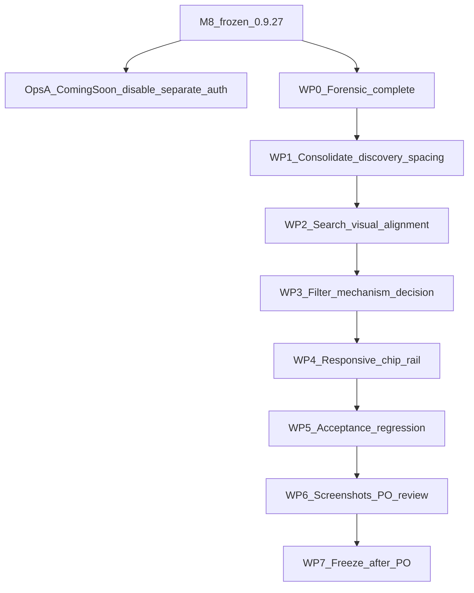

# M9 — Shop Discovery Consolidation (Frozen Plan)

**Status:** **FROZEN** — definitive implementation specification (PO-approved with corrections). Implementation proceeds under separate authorization in the same execution window after this documentation commit.
**Ops A prerequisite:** WooCommerce Coming Soon disabled on DEV (`woocommerce_coming_soon=no`); `blog_public=0` verified; anonymous `/shop/` accessible. Ops A is **not** part of this M9 release artifact.
**Milestone identifier:** **M9** (confirmed: no storefront-redesign M9 exists; M-track ends at M8 freeze `storefront-v0.9.27` / `0.9.27` on `biopentra-custom-plugins` `main`).
**Baseline:** M8 PO-approved / frozen on DEV (`CHANGELOG.md` `[0.9.27]`, commit `f8d0a09`). Repo clean vs `origin/main`.
**PO review correction (2026-08-22):** filter architecture is a **WP3 implementation decision**, not a predetermined “remove `b3a2918` + restyle chips” approach. See §8–10 / WP3.
**Convention of record (same as M8):** plan at [`docs/storefront-redesign/plans/MILESTONE_M9_*.md`](dev/biopentra-custom-plugins/docs/storefront-redesign/plans/); status via `CHANGELOG.md` `[Unreleased]` → freeze entry + tag `storefront-v{ver}`; acceptance `tests/m9-*.spec.ts`. Do **not** invent a new track; do **not** treat the stale redesign-repo `STATUS.md`/`ROADMAP.md` (still stop at M7 / “do not start M8”) as authority.



---

## 1. Executive summary

Shop page **3755** already has the right pieces in the wrong composition: a frozen hero, a working shop search (`[biopentra_shop_search]`), homepage-style archive chips (`[biopentra_home_categories]`), **and** a second Elementor Pro taxonomy-filter that AJAX-filters the frozen loop-grid. That duplication is intentional Milestone B layering, not a CSS bug — chips navigate away to category archives; tabs filter in place.

**UX target (locked):** one search + one category discovery rail that **filters the Shop grid in place**, M3 visual language, no Uncategorized chip, keep **All**, freeze hero/cards/grid/header/M8 footer/homepage M1–M7.

**Filter architecture (corrected):** do **not** assume that removing Elementor taxonomy-filter `b3a2918` while “preserving the Elementor filter URL contract” is automatically coherent — `b3a2918` may own Elementor’s filtering machinery for loop `ed52b7f`. WP3 must determine the **smallest maintainable mechanism** that lets the single chip rail control `ed52b7f`, prove it, and only then retire `b3a2918` from the customer-facing tree. No custom filter system unless proven necessary. A hidden duplicate taxonomy-filter is **not** an acceptable final architecture unless documented technical necessity.

Separately, anonymous DEV Shop access is blocked by **WooCommerce Coming Soon (store pages only)**. Opening it is **Ops A** (options flip), not M9 code. Keep `blog_public=0` (meta `noindex, nofollow`). Do **not** block M9 on robots.txt / `X-Robots-Tag` / Cloudflare Managed robots — that is **separate future infrastructure hardening**.

---

## 2. Verified current repository / DEV state

| Fact | Evidence |
|---|---|
| Plugin source | [`/opt/biopentra/dev/biopentra-custom-plugins/plugins/biopentra-storefront/`](dev/biopentra-custom-plugins/plugins/biopentra-storefront/) (symlink [`dev/biopentra-storefront`](dev/biopentra-storefront)) |
| Version / freeze | `0.9.27` / `storefront-v0.9.27`; `main == origin/main` |
| Shop page | ID **3755**, meta `bp_shop_v2_applied=1`, template `elementor_header_footer` |
| Loop card template | **3608** (unchanged) |
| Anonymous `/shop/` | **Ops A complete:** real Shop HTML (`bp-shop-hero`); Coming Soon off |
| Anonymous `/` | Live homepage (Coming Soon is store-only) |
| Meta robots | `noindex, nofollow` (Rank Math / `blog_public=0`) |
| `X-Robots-Tag` | **Absent** on HTML responses |
| `robots.txt` | Cloudflare Managed: general `Allow: /`; AI bots `Disallow`; WC path disallows; sitemap exposed |

---

## 3. Correct milestone identifier

**M9 — Shop Discovery Consolidation** (Premium Ecommerce numbered track). Not Milestone B2; not Motion; not a lettered-track reopen.

---

## 4–5. Shop page / template ownership (Elementor IDs)

Verified via `wp post meta get 3755 _elementor_data`:

| Order | ID | Role | Owner |
|---|---|---|---|
| Hero | `61f84d4` `.bp-shop-hero` | Frozen Shop hero | Elementor + [`shop-v2.css`](dev/biopentra-custom-plugins/plugins/biopentra-storefront/assets/css/shop-v2.css) |
| Search band | `b2srch0` / `b2srch1` | `[biopentra_shop_search]` | storefront shortcode |
| Chip band | `b2cats0` / `b2cats1` | `[biopentra_home_categories]` | storefront shortcode (archive links today) |
| Products | `eae00bb` | Products section | Elementor |
| Taxonomy filter | **`b3a2918`** | AJAX category tabs → loop `ed52b7f` | Elementor Pro + loop-card bridges — **runtime role to be proven in WP3 before removal** |
| Loop grid | **`ed52b7f`** → template **3608** | Product grid | Elementor + loop-card |
| Disclaimer | `f2917e3` | Compliance copy | Elementor |
| Injected | `#mp-category-description` | Post-grid SEO panels | loop-card (currently binds to `b3a2918`) |

Replay baseline CLI: [`setup-shop-page-v2-cli.php`](dev/biopentra-custom-plugins/plugins/biopentra-storefront/scripts/setup-shop-page-v2-cli.php). Backup: [`shop-pre-B.json`](docs/storefront-redesign/changes/backups/shop-pre-B.json).

---

## 6–7. Search ownership and visual alignment

| Surface | Implementation | Behavior |
|---|---|---|
| Shop (canonical) | [`biopentra_storefront_get_shop_search_form_html()`](dev/biopentra-custom-plugins/plugins/biopentra-storefront/includes/shopping-v2-helpers.php) → `[biopentra_shop_search]` → `#biopentra-shop-s` | GET `/shop/?s=` filters Elementor loop via loop-card `elementor/query/query_args` |
| Typeahead | [`shop-live-search.js`](dev/biopentra-loop-card/assets/shop-live-search.js) | REST suggestions; Enter still full GET |
| Homepage (M3) | **No on-page search** | Header chrome routes to shop `#biopentra-shop-s` ([`chrome-v1.js`](dev/biopentra-custom-plugins/plugins/biopentra-storefront/assets/js/chrome-v1.js)) |
| SEO guides | `[biopentra_home_search]` | Different destination: `/?s=&post_type=product` |

**Explicit wording (PO-corrected):** The earlier assumption that Shop can “reuse the homepage search component” was wrong — homepage no longer hosts on-page search (M3). Shop must **retain its existing functional search implementation** (`[biopentra_shop_search]`, `#biopentra-shop-s`, loop-card live-search + `?s=` loop query) and **adopt the homepage discovery visual language** (M3 tokens, spacing, rail, input density). Do not invent a second search stack. Do not switch shop to `[biopentra_home_search]` (wrong destination).

---

## 8–10. Category ownership, duplication root cause, filtering behavior

**Why categories appear twice**

1. **Row 1 — chips** (`b2cats1`): `[biopentra_home_categories]` → plain links to `/product-category/{slug}/` (leave Shop). On shop, Uncategorized is **included** (homepage-only exclusion via `is_front_page()` in [`home-v2-helpers.php`](dev/biopentra-custom-plugins/plugins/biopentra-storefront/includes/home-v2-helpers.php)).
2. **Row 2 — taxonomy-filter** (`b3a2918`): Elementor Pro AJAX filter of loop `ed52b7f` via URL param `e-filter-ed52b7f-product_cat`; includes **All**; drives `#mp-category-description` JS ([`shop-category-description.js`](dev/biopentra-loop-card/assets/shop-category-description.js) binds to `.elementor-element-b3a2918`).
3. Mobile CSS already **hides** the taxonomy-filter (`shop-v2.css` `@media max-width:767px`), leaving only archive chips — so desktop feels duplicated and mobile already lost in-page filter UX.

**They are not the same operation:** chips = navigation; tabs = in-page AJAX filter.

### UX locked

One chip rail that **filters the Shop grid in place**. Homepage chips remain archive links (M3 frozen).

| Decision | Choice | Rationale |
|---|---|---|
| **All** | **Keep** | Chips filter the grid; All clears category constraint |
| **Uncategorized** | **Hide from Shop discovery chips only** | Navigation design, not taxonomy cleanup. Term remains (count=14). Products still under All / search. **No further PO decision required.** |
| Archive navigation | Still via header/megamenu / category URLs; Shop discovery no longer duplicates it |

### WP3 — required filter-architecture decision (PO-corrected)

**Do not predetermine** “delete `b3a2918` and drive the loop solely from restyled `[biopentra_home_categories]` markup.”

WP3 must:

1. Preserve the existing **Elementor / loop-card filtering contract** where practical (loop `ed52b7f`, URL param `e-filter-ed52b7f-product_cat`, loop-card clear-when-unfiltered, category-description sync).
2. Determine the **smallest maintainable mechanism** that allows the new single chip rail to control `ed52b7f`.
3. **Not remove `b3a2918` until its runtime role has been replaced and proven** (acceptance: filter All + a category changes the grid; URL/history behavior matches what Elementor already provides where retained).
4. Reject a **hidden duplicate taxonomy-filter** as the final architecture unless there is a **documented technical necessity** (and even then, document why no smaller supported path exists).
5. Avoid building an unnecessary custom filtering system when Elementor’s existing machinery can be restyled, adapted, or lightly bridged.

Candidate paths WP3 may evaluate (non-prescriptive order): restyle/adapt `b3a2918` into the M3 chip language as the sole visible control; bridge custom chip UI to Elementor’s filter API/DOM while `b3a2918` remains the supported engine until proven removable; only then remove `b3a2918` from the Elementor tree via idempotent CLI.

---

## 11–12. Proposed composition

**Overall target**

```text
HERO
────────────────────────────

Search products...

Shop by category
[ All ] [ Growth & Performance ] [ Recovery Support ]
[ Research Supplies ] [ Weight Management ] [ Wellness ] ...

────────────────────────────
PRODUCT GRID
```

**Desktop (≥1025)** — single compact chip row where space permits (All + six useful categories likely fit). Controlled wrap only when genuinely necessary — **wrapping is not the default design target**.

**Tablet / narrow desktop (≤1024)** — horizontal scrolling rail (same language as homepage).

**Mobile (360–430)**

```text
Search products...

Shop by category
[ All ][ Growth & Performance ][ Recovery Support ] →

PRODUCT GRID
```

Deliberately expose a **partial next chip** where feasible so scrollability is visually obvious. Scrollbar hidden; ≥44px targets; no multi-row wall; no desktop tabs squeezed.

Breakpoints: acceptance set **360 / 390 / 430 / 768 / 1024 / 1025 / 1440 / 1680**. Prefer M-track **1024/1025** for discovery layout (align with M3/M8). Retire the older shop-only `767` “hide taxonomy-filter” special case once the duplicate customer-facing filter UI is gone.

---

## 13–14. Search / chip strategies

- **Search:** retain Shop functional stack; adopt M3 discovery **visual** language only (see §6–7).
- **Chips:** one customer-facing rail with “Shop by category” label, Uncategorized excluded, All included, M3 classes/tokens scoped to shop (today denser M3 look is largely `body.home`-gated in [`home-v2.css`](dev/biopentra-custom-plugins/plugins/biopentra-storefront/assets/css/home-v2.css)). Exact DOM ownership (shortcode vs restyled Elementor filter items) is **WP3’s output**, not predetermined here.
- Category-description sync must follow whatever control becomes the active filter source after WP3.

---

## 15–16. All / Uncategorized (confirmed)

- **All:** remain.
- **Uncategorized:** omit from Shop discovery; do not delete WC category; do not change product term assignments. Count=14 noted; products remain under All and search — **PO accepts; no further decision**.

---

## 17–19. Responsive, a11y, performance

- ≥1025: prefer one compact row; ≤1024 / 360–430: horizontal scroll + partial next-chip affordance on small phones.
- Keyboard: chips focusable; `aria-pressed` / `aria-current` for active filter; label + `aria-label` on nav.
- Touch ≥44px; focus-visible per M3 cyan treatment.
- No motion milestone work; no new animation libraries.
- No extra search network path beyond existing live-search + GET submit.
- Avoid large empty vertical gaps between hero → search → chips → grid.

---

## 20–23. Anonymous DEV / Coming Soon / anti-indexing

### Findings

| Question | Answer |
|---|---|
| What gates anonymous Shop? | **WooCommerce Coming Soon**, store-only: `woocommerce_coming_soon=yes`, `woocommerce_store_pages_only=yes`, `woocommerce_private_link=no` |
| Login wall? | No. Admins with `manage_woocommerce` bypass; others see Coming Soon HTML (HTTP 200) |
| Proxy/SWAG auth? | **No** |
| Elementor maintenance? | Off |
| `blog_public` | **0** → meta `noindex, nofollow` |
| `noarchive` / `X-Robots-Tag` | **Not** present today |
| robots.txt `Disallow: /` | **No** — Cloudflare Managed `Allow: /` |
| Scraping vs indexing | Meta/robots are indexing politeness, not anti-scrape. Cloudflare/WAF left alone |

**Security boundary check:** Disabling Coming Soon does not remove wp-admin auth, SSH/UFW, or expose DB/Redis. It makes store HTML anonymously viewable — desired for PO QA.

### Ops A (PO decision — sufficient for M9 QA)

**In scope:**

- Disable WooCommerce Coming Soon (`woocommerce_coming_soon` → `no`)
- Verify `blog_public` remains `0` (meta noindex/nofollow)

**Out of scope for Ops A / M9** (separate future infrastructure hardening — do not block M9):

- robots.txt sitewide `Disallow: /`
- HTTP `X-Robots-Tag: noindex, nofollow, noarchive`
- Cloudflare Managed robots / WAF changes

### Recommended DEV procedure (Ops A — separate authorization)

```bash
cd /opt/biopentra/apps/wordpress
docker compose run --rm wpcli wp --skip-plugins=ai-multilingual option update woocommerce_coming_soon no
# verify anonymous Shop HTML (not Coming Soon):
curl -sL https://dev.biopentra.eu/shop/ | grep -E 'bp-shop-hero|coming-soon'
# verify indexing discourage still on:
docker compose run --rm wpcli wp --skip-plugins=ai-multilingual option get blog_public
# expect: 0
```

Optional cache flush / Cloudflare purge if Coming Soon HTML sticks (`Cache-Control: max-age=60` observed).

**Not part of M9 git release** — options-only; no tag/version bump.

### Rollback (Coming Soon)

```bash
docker compose run --rm wpcli wp --skip-plugins=ai-multilingual option update woocommerce_coming_soon yes
# leave store_pages_only=yes
```

Acceptance harness alternative (no public open): keep Coming Soon + `wp-coming-soon.sh` private-link / `woo-share` cookie ([`helpers/coming-soon.ts`](dev/storefront-acceptance/helpers/coming-soon.ts)).

---

## 24. Implementation ownership by file/layer (later)

| Layer | Likely touch |
|---|---|
| Elementor page 3755 | Backup JSON; discovery spacing classes; **remove or retain `b3a2918` only per WP3 proof** |
| storefront PHP | [`home-v2-helpers.php`](dev/biopentra-custom-plugins/plugins/biopentra-storefront/includes/home-v2-helpers.php), [`shopping-v2-helpers.php`](dev/biopentra-custom-plugins/plugins/biopentra-storefront/includes/shopping-v2-helpers.php), new `scripts/setup-m9-shop-discovery-cli.php` as needed |
| storefront CSS | [`shop-v2.css`](dev/biopentra-custom-plugins/plugins/biopentra-storefront/assets/css/shop-v2.css), M3 token/chip selectors extended for shop (not only `body.home`) |
| loop-card | Category-description / loop-filter bridges **only if** WP3 changes the active filter source |
| Acceptance | new `tests/m9-shop-discovery.spec.ts`; update [`shop-ia.spec.ts`](dev/storefront-acceptance/tests/shop-ia.spec.ts) |
| Docs | `MILESTONE_M9_SHOP_DISCOVERY.md`, `CHANGELOG.md` `[Unreleased]` |

**Do not touch:** M1–M8 homepage/footer/header beyond unavoidable shared chip selector extension; product card template 3608; production; Cloudflare robots as part of M9.

---

## 25. Idempotent migration / Elementor strategy

Pattern = M8 footer CLI:

1. Backup `_elementor_data` for 3755 → `docs/storefront-redesign/changes/backups/shop-pre-M9.json`
2. `setup-m9-shop-discovery-cli.php`: idempotent structural/spacing updates; set meta flag e.g. `bp_shop_m9_applied=1`; preserve hero/grid/disclaimer IDs
3. **Taxonomy-filter widget removal is conditional on WP3 proof** — CLI must not delete `b3a2918` until replacement is verified
4. Re-run safe; clear Elementor CSS cache as per prior milestones

---

## 26–28. Acceptance, screenshots, cache

- Playwright projects: existing viewport set (360…1680).
- Specs: hero → search → **one** category rail → grid; no Uncategorized chip; All present; filter changes grid; ≥1025 prefers single row; ≤1024 / 360–430 horizontal scroll (+ partial next chip on small phones); no page overflow; ≥44px; keyboard; meta robots still noindex after Ops A; Coming Soon absent when Ops A applied.
- Screenshots: discovery band at 390 + 1440 (and PO set).
- Cache: Elementor CSS, WP cache, Cloudflare if HTML stale.

---

## 29–30. Rollback / production replay

**Shop rollback:** restore `shop-pre-M9.json`; revert plugin commits / prior `storefront-v0.9.27`; loop-card prior tag if touched.
**Production:** **no replay in M9.** DEV-only until explicit PO GO.

---

## 31. Explicit non-goals

Motion & Interaction Polish; Shop hero redesign; product cards/quick-add/grid redesign; header; M8 footer; homepage M1–M7 reopen; PDP/category archive redesign beyond discovery coupling; checkout/cart; deleting Uncategorized term; production deploy; version tag until post-impl PO visual freeze; **robots.txt / X-Robots-Tag / Cloudflare Managed robots** (future infra, not M9/Ops A).

---

## 32. Work packages

| WP | Scope | Auth |
|---|---|---|
| **Ops A** | Disable Coming Soon; verify `blog_public=0`; rollback doc. **No** robots.txt/X-Robots work. | **Separate PO ops approval** |
| **WP0** | Forensic audit (complete) | Done |
| **WP1** | Discovery spacing / structure consolidation; **do not remove `b3a2918` until WP3** | M9 impl |
| **WP2** | Shop search **visual** alignment with homepage discovery language; keep functional stack | M9 impl |
| **WP3** | **Filter-mechanism decision + proof** → single chip rail drives `ed52b7f`; Uncategorized hide; All; description sync; remove `b3a2918` only after proven | M9 impl |
| **WP4** | ≥1025 single row preference; ≤1024 scroll rail; 360–430 partial next chip | M9 impl |
| **WP5** | Acceptance + regression | M9 impl |
| **WP6** | Screenshots / live PO visual review | M9 impl |
| **WP7** | Freeze only after **explicit PO approval of implemented result** | M9 closure |

---

## 33. Acceptance criteria (plan targets)

- Anonymous Shop reachable **after Ops A**
- DEV remains `noindex` via `blog_public=0` / meta robots (robots.txt hardening **not** required to pass M9)
- Exactly **one** category discovery treatment; search once
- No customer-facing **Uncategorized** chip
- **All** works; category chips filter grid correctly via the WP3-chosen supported mechanism
- ≥1025: single compact row where space permits
- ≤1024 / mobile: horizontal scroll; 360–430 partial next-chip affordance where feasible
- No horizontal page overflow; no clipped labels; keyboard/focus OK; ≥44px mobile targets
- Hero, product cards/grid, footer, homepage frozen surfaces unchanged
- No production changes
- Final architecture does **not** rely on a hidden duplicate taxonomy-filter unless documented necessity

---

## 34. Risks / open implementation items

1. **Ops A vs M9:** two authorizations — open DEV first for anonymous PO QA.
2. **WP3 filter proof (primary risk):** Elementor may require `b3a2918` (or equivalent Pro filter widget) for supported AJAX filtering of `ed52b7f`. Implementation must prove the chosen path before deleting the widget.
3. **loop-card coupling:** category-description JS currently hard-binds to `b3a2918`; any control-source change needs a coordinated update (possible loop-card bump).
4. **Future infra (not blocking):** `Disallow: /` + `X-Robots-Tag: noindex, nofollow, noarchive` tracked separately from M9.
5. Redesign-repo `STATUS.md`/`ROADMAP.md` remain stale; M9 docs follow custom-plugins `CHANGELOG` + `MILESTONE_M9_*.md` convention.

**Resolved by PO (no longer open):** Uncategorized hide-only; in-page filter UX (not archive-only chips); Ops A scope = Coming Soon + `blog_public` verify only; do not block M9 on robots.txt.

---

## STOP

Plan wording is ready for implementation authorization. Still do **not** implement until an explicit PO implementation prompt. No Coming Soon change, no Elementor mutation, no storefront/loop-card code, no version bump, no tag, no production work from this plan document alone.
