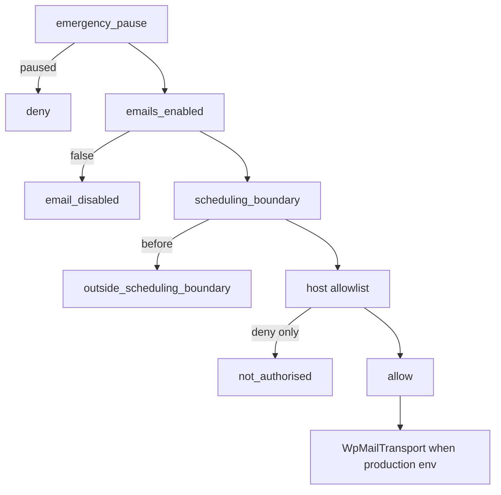
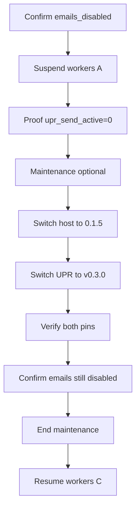

# M3 production invitation-email rollout (authoritative freeze)

> **Ownership correction (2026-08-27):** Production host package target is no longer `biopentra-upr-host` **0.1.5**. Future target is standalone [`upr-host-adapter`](https://github.com/magpern/upr-host-adapter) **`v0.1.0`**. See [`upr-host-adapter-ownership-addendum.md`](upr-host-adapter-ownership-addendum.md). Production remains **NO-GO**; no production deploy has occurred.

**Status:** **NO-GO / BLOCKED** — planning freeze only.  
**Freeze tag:** `m3-production-invitation-rollout-freeze` (annotated; peels to this documentation merge).  
**Does not authorise** production invitation email, allowlist population, historical reconciliation backfill, deployment, or customer contact.  
**P1–P8** in this document must be complete before any production pilot execution.  
**Production is not changed by this freeze.** Only a later, separately approved execution order may perform Phase A onward.

**Source:** Revised Cursor planning document (pair transition, host 0.1.5, mandatory worker suspend, fixed rollback, synthetic pause drill as later gate).

---

**Status:** Planning artifact only — **does not authorise or execute** production changes.  
**DEV baseline (accepted):** custom-plugins PR #21 / `345a8b0…`; UPR `v0.3.0` → `b2abc2defc30fc023601593aa1720cbfdd0a4f3c`; host pilot policy merge `13c9b4a…` shipped as plugin **0.1.4** (DEV bind-mount only).  
**Production host target (mandatory):** **`biopentra-upr-host` 0.1.5** — new tested release **after** WP-C (pin without `.git`). **Do not deploy 0.1.4 as a production package.** Exact `0.1.5` merge SHA is recorded when WP-C merges; until then production host pin is **unset / blocked**.

---

## 1. Executive recommendation and go/no-go prerequisites

**Recommendation: NO-GO.** Do not deploy, enable, or send production invitation emails.

The **software safety model** is DEV-proven (master enable default off, emergency pause + revoke, scheduling boundary / no retro-send, host order-ID allowlist restrictive-only). That does **not** authorise production contact.

**Go/no-go prerequisites:**

| ID | Prerequisite |
|----|--------------|
| P1 | Staged SHA-verified **release directories** + **coordinated pair transition** for UPR+host (see §6), including **mandatory** worker suspend/proof/resume commands — not in-place rsync/ZIP overwrite; **not** a single multi-plugin flip. If worker suspension cannot be enforced → **NO-GO** |
| P2 | SHA-verified packages for UPR **`v0.3.0`** and host **`0.1.5` only** |
| P3 | Read-only live production inventory (env, versions, mail path, AS counts, cron) — no PII |
| P4 | Live production token-redaction proof on every URI-bearing access/cache log + external sink confirmation |
| P5 | Restricted approval ledger (order ID + required fields) outside public Git |
| P6 | DB backup + restore-time note |
| P7 | Product Owner final customer-contact approval after documentation freeze |
| P8 | **Operational** production emergency-pause drill on a synthetic `@example.invalid` fixture proving token/session revoke + pending-job cancel — **not** a dry checklist. If that drill cannot run safely on production → **remain NO-GO** |

Until P1–P8: emails disabled, no allowlist, no production contact.

---

## 2. Confirmed current-state findings and evidence

### Topology

| Fact | Evidence |
|------|----------|
| DEV ≠ production | [`CLAUDE.md`](CLAUDE.md): DEV `dev.biopentra.eu`; prod WP `173.212.213.37` `/home/magpern/woocommerce`, `www.biopentra.eu` |
| Prod cache SWAG (documented) | `169.40.135.140` — [`prod-deployment-rollback.md`](dev/biopentra-cache-infrastructure/docs/prod-deployment-rollback.md) |
| No prod compose under `/opt/biopentra` | Confirmed |

### Software pins

| Artifact | Role | Pin |
|----------|------|-----|
| UPR | Production core | Annotated **`v0.3.0`** → `b2abc2defc30fc023601593aa1720cbfdd0a4f3c` |
| Host **0.1.4** | Current main / DEV rehearsal | Pilot policy + `.git`-based pin — **not** a production ZIP target |
| Host **0.1.5** | **Sole production host target** | WP-C: same pilot policy + **embedded UPR commit/tag verification without `.git`**; DEV-tested against UPR `v0.3.0`; merge SHA recorded at cut |
| Storefront / child | If PDP in scope | ≥ 0.9.39 / ≥ 1.2.13 — live prod versions **unknown** |
| Cache redaction configs | Canonical | `$bp_log_request_uri` in prod templates — **live unproven** |

### Why 0.1.4 cannot be the production package target

[`class-upr-pin.php`](dev/biopentra-custom-plugins/plugins/biopentra-upr-host/includes/class-upr-pin.php) `resolve_installed_commit()` reads the UPR plugin’s **`.git`**. Packaged/ZIP installs have no `.git` → pin fails closed or is unusable. Production therefore targets **0.1.5** after WP-C, not “0.1.4 plus a vague fix.”

### Invitation safety model (code — confirmed)



- Default emails **off**; enable/unpause refresh boundary (no reconcile retro-send)
- Pause revokes outstanding tokens/sessions and cancels pending sends
- Host cannot upgrade core denials
- UPR activate = migrator + rewrite flush only
- Host `verify-*-dev` CLIs unusable on production; use `wp upr invitation-controls`

### DEV rehearsal (accepted — not production proof)

PR #21 / `345a8b0…`: R1–R10 PASS; LoggingMailTransport; dual-log redaction on DEV.

### Production deploy (confirmed gap)

Only in-place ZIP / `wp plugin install` / rsync documented. No `releases/current` symlink layout for WP plugins. Flipping two plugin symlinks independently is **not** pair-atomic (see §6).

---

## 3. Unknowns and blockers before a freeze

1. Pair-transition deploy mechanism (WP-A) with **mandatory** suspend/proof/resume literals — **missing**; unenforceable suspend ⇒ **NO-GO**
2. Packages for UPR `v0.3.0` + host **0.1.5** — **missing** (0.1.5 not cut yet)
3. Live prod inventory (including exact WP-Cron/AS runner identity for suspend) — **unknown**
4. Live prod redaction/sinks — **unproven**
5. Approval ledger system — **undefined**
6. Host **0.1.5** not yet implemented/tested — **blocker**
7. Prod tabs-off if PDP in scope — **unknown**
8. Whether a **safe** synthetic `@example.invalid` pause drill can run on production — **must be designed; failure ⇒ NO-GO (P8)**

**Assumptions (unverified):** prod `wp_mail` path; AS external cron reliability; Cloudflare Logpush absent.

---

## 4. Exact production scope and non-goals

**In scope (after GO):** Deploy UPR `v0.3.0` + host **0.1.5** via §6 transition; emails disabled through deploy; one-order pilot after ledger; operational pause drill (P8); evidence without PII/raw tokens.

**Non-goals:** Historical backfill; host code in UPR; deploying **0.1.4** packages; raw SQL / ad-hoc live file copy; DEV verify CLIs on prod; dry-checklist-only pause “proof”; claiming a single atomic flip of two plugins; conditional/optional worker suspension; operator-chosen rollback order.

---

## 5. Repository ownership and immutable version-pinning map

| Concern | Owner | Production pin |
|---------|-------|----------------|
| UPR core | `universal-product-reviews` | `v0.3.0` / `b2abc2d…` |
| Host adapters + pilot policy | `biopentra-custom-plugins` / `biopentra-upr-host` | **`0.1.5`** (post–WP-C merge SHA TBD at cut; embeds required UPR commit) |
| PDP / CSS (optional window) | storefront / blocksy-child | ≥ 0.9.39 / ≥ 1.2.13 if in scope |
| Log redaction | cache-infra + prod SWAG | `$bp_log_request_uri` formats |
| Approval ledger | Restricted ops system | Order ID + fields only |

**Mix prevention:** After the pair transition, both plugins must report exact pins before workers resume. Preflight: `UPR_VERSION`, host `0.1.5`, embedded UPR commit match, `InvitationAuthorisation` present, emails still **disabled**.

---

## 6. Deployment and rollback design (coordinated pair transition)

**Do not describe UPR+host cutover as one atomic flip.** Two release-dir switches are **ordered and gated**. The window is protected by (1) emails disabled, (2) **mandatory** worker suspension with proof, (3) optional maintenance. Each slug keeps `previous`. Pair rollback uses **one fixed order** (§6.3)—operators never choose order during an incident.

### 6.1 Release layout (per plugin)

- Stage `releases/{slug}/{version}/` with sha256 manifest  
- `wp-content/plugins/{slug}` → symlink/rename to staged tree  
- Keep `previous` for that slug  

### 6.2 Mandatory worker suspend / proof / resume (WP-A deliverable)

Worker suspension is **required**, not optional. If production cannot enforce it, **deployment remains NO-GO**.

WP-A must publish and rehearse a runbook whose **literal production commands** are filled from WP-D inventory (crontab path, compose service names). Until those literals are locked and rehearsed, P1 is unmet.

**Normative control (exact slots; production strings locked by WP-A):**

Working directory on production WP host: `/home/magpern/woocommerce` (compose root per ops docs). WP-CLI: `./wp` as documented.

**A. Suspend (required sequence, in order)**

1. Confirm emails disabled (refuse to continue if not):

```bash
./wp upr invitation-controls
# require invitation_emails_enabled=false
```

2. Cancel pending UPR invitation schedule/send actions (AS group `upr`):

```bash
./wp eval 'if (!class_exists("\\UniversalProductReviews\\Scheduling\\Jobs")) { echo "NO_JOBS_API\n"; exit(1);} \\UniversalProductReviews\\Scheduling\\Jobs::cancel_pending_invitation_sends(); if (function_exists("as_unschedule_all_actions")) { as_unschedule_all_actions("upr_reconcile_invitations", null, "upr"); } echo "CANCEL_OK\n";'
```

3. **Suspend the production WP-Cron / AS runner** so no new `upr_send_*` can start mid-switch. WP-A locks the exact production command after inventory; the required *form* is one of:

```bash
# Example shape only — replace with the verified production crontab/unit line from WP-D:
sudo crontab -l | tee /home/magpern/backups/crontab-pre-m3-upr.txt
# Disable the single line that invokes WP-Cron / wp-cron equivalent for this stack
# (e.g. comment out the documented */5 wp cron event run / wp eval file), then:
# proof crontab no longer contains the active runner entry
```

If production uses a dedicated compose runner for cron/AS, WP-A locks instead:

```bash
docker compose stop <verified-cron-or-as-runner-service>
```

**Do not** leave “pause if cleanly possible.” Either the locked suspend command works in rehearsal, or **NO-GO**.

4. Optional but recommended if dual-version HTML risk is material: enable maintenance mode (exact plugin/CLI command locked in WP-A).

**B. Proof no UPR send action is running (required gate before any symlink switch)**

```bash
./wp eval 'global $wpdb; $n=(int)$wpdb->get_var("SELECT COUNT(*) FROM {$wpdb->prefix}actionscheduler_actions a INNER JOIN {$wpdb->prefix}actionscheduler_groups g ON a.group_id=g.group_id WHERE g.slug=\"upr\" AND a.status IN (\"pending\",\"in-progress\") AND a.hook IN (\"upr_send_initial_bundle\",\"upr_send_reminder_item\",\"upr_schedule_order_items\")"); echo "upr_send_active=$n\n"; exit($n===0?0:1);'
```

Exit **0** with `upr_send_active=0` required. Non-zero → **abort**; do not switch plugins.

**C. Resume (required sequence, only after pin verify + emails still disabled)**

1. Re-confirm `invitation_emails_enabled=false` via `./wp upr invitation-controls`  
2. Resume the **same** runner suspended in A.3 (exact inverse command locked by WP-A), e.g. restore crontab from `crontab-pre-m3-upr.txt` **or** `docker compose start <verified-cron-or-as-runner-service>`  
3. Re-run proof query: may show pending reconcile later; **send** hooks must remain 0 while emails disabled / pilot deny holds  
4. Disable maintenance if it was enabled  

Mail worker (`biopentra-mail-worker`): invitation mail uses UPR→`wp_mail`. WP-A must state whether that service must also be stopped during the window; if inventory shows it can dequeue invitation traffic independently of AS, include its `docker compose stop` / `start` in the **same** mandatory suspend/resume list. If unknown after WP-D → treat as blocker until classified.

### 6.3 Pair transition sequence (UPR + host)

**Verified deployment order (fixed):**



1. Precondition: emails **disabled**; pilot fail-closed.  
2. **Suspend** (§6.2 A) — mandatory.  
3. **Proof** (§6.2 B) — mandatory.  
4. Maintenance if required by WP-A.  
5. **Switch host** → **0.1.5**.  
6. **Switch UPR** → **`v0.3.0`**.  
7. Verify both exact pins + `InvitationAuthorisation`; on failure → **pair rollback §6.4** (do not resume workers until rollback verify or successful forward verify).  
8. Confirm emails still **disabled**.  
9. End maintenance.  
10. **Resume** (§6.2 C) — only after successful verify.

Optional storefront/child: **separate** runbook, not interleaved with this pair.

### 6.4 Pair rollback sequence (fixed — reverse of deployment)

**Operators must not choose order during an incident.**

**Fixed rollback order = reverse of verified deployment order:**

1. Confirm/ensure emails **disabled**.  
2. **Suspend** workers (§6.2 A) if not already suspended; **proof** `upr_send_active=0`.  
3. Maintenance if used on the way forward.  
4. **Switch UPR** → that slug’s `previous`.  
5. **Switch host** → that slug’s `previous`.  
6. Verify both `previous` pins (or documented pre-deploy versions).  
7. Confirm emails still **disabled**.  
8. End maintenance.  
9. **Resume** workers (§6.2 C).  

WP-A ships a single script/runbook entrypoint, e.g. `pair-rollback-upr-host.sh`, that executes **only** this order. No alternate “host first” path in the incident runbook.

**Forbidden:** live rsync into plugin dirs; UPR `v0.3.0` against host **0.1.4** packages; enabling mail during transition/rollback; skipping suspend/proof; improvising rollback order.

**Migrations:** DB backup before first UPR `v0.3.0` activate; migrator must not enable emails.

---

## 7. Pilot authorization, privacy, and customer-communication controls

Unchanged in substance: order-ID allowlist + authorised flag; fail-closed empty list; cannot upgrade core denials; restrict who may edit settings; ledger fields (operator, UTC time, order ID, reason, recipient-contact authorisation, expiry, rollback owner); no PII/tokens in git; GitHub comments insufficient unless restricted and field-complete.

---

## 8. Production configuration sequence (emails disabled first)

1. Land **0.1.5** (WP-C) + packages (WP-B) + pair transition (WP-A); complete P3–P6, P8 design  
2. Documentation-freeze this plan; execute only on separate order  
3. DB backup  
4. Run §6.2 pair transition to UPR `v0.3.0` + host **0.1.5**  
5. No write reconcile backfill  
6. Prod token-redaction proof (synthetic)  
7. Optional PDP/tabs sequence  
8. Phase A acceptance — **still no customer mail**  
9. **P8 pause drill** before any enable/allowlist for real orders (see §9 G-C)

---

## 9. Limited pilot execution sequence (explicit gates)

| Gate | Action |
|------|--------|
| G-A | Phase A deploy accepted (pins = UPR `v0.3.0` + host **0.1.5**; emails off) |
| G-B | Ledger for **one** real order ID + contact authorisation + expiry |
| G-C | **Operational emergency-pause drill** on production using synthetic `@example.invalid` fixture only: issue token/session under controlled path → pause → prove revoke + pending send cancel → unpause with boundary refresh and **no** retro-send. Evidence: pause meta, revoked markers, AS counts (no PII, no raw tokens). **If unsafe/impossible → stop; NO-GO for pilot send** |
| G-D | Allowlist + pilot authorised (emails still off); prove non-listed deny |
| G-E | Enable master emails (boundary refresh); no send until G-F |
| G-F | Final approval → one controlled post-boundary send to allowlisted order |
| G-G | Prove production transport ≠ LoggingMailTransport (class / provider id; no recipient dump) |
| G-H | Expansion only via new ledger rows |

---

## 10. Validation matrix and evidence to retain

| Area | Evidence |
|------|----------|
| Pins | UPR `0.3.0`/`b2abc2d…`; host **`0.1.5`** + embedded UPR commit |
| Emails disabled through deploy | invitation-controls |
| Pair transition | Runbook steps logged; workers suspended/resumed timestamps |
| AS counts | By hook only |
| Redaction | Synthetic token; all URI-bearing prod logs |
| Sinks | Config inventory |
| **Pause drill (P8/G-C)** | Synthetic `@example.invalid` order/product IDs; revoke+cancel proof; unpause no retro |
| One customer send | Only after G-F; order ID + provider id |
| No backfill | dry-run deny counts; no write backfill |
| Storefront/schema/sticky | read-only smokes if in scope |

---

## 11. Emergency-stop and rollback runbook

1. Pause invitations (revoke tokens/sessions; cancel pending sends)  
2. Disable master emails  
3. Clear allowlist; pilot authorised false  
4. Confirm send-hook pending = 0  
5. Pair rollback via fixed script **only** (§6.4: UPR `previous`, then host `previous`, emails disabled, workers suspended throughout)  
6. Preserve redacted evidence; notify rollback owner  

---

## 12. Monitoring, metrics, and pilot exit criteria

Unchanged: deny/allow reason codes; pause events; boundary; AS latency/failures; redaction Sev-1; abort on off-cohort send or pause failure.

---

## 13. Work packages

| WP | Deliverable | Done when |
|----|-------------|-----------|
| **WP-C** | Host **0.1.5**: pin via embedded UPR commit file (no `.git`); policy checks; DEV bind-mount test vs `v0.3.0` | Tag/version **0.1.5** merged; merge SHA recorded; **0.1.4 explicitly retired as prod package target** |
| **WP-B** | SHA packages for UPR `v0.3.0` + host **0.1.5** | Checksums verified on throwaway install |
| **WP-A** | Release dirs + §6.2–6.4 runbook: **exact** suspend/proof/resume commands; fixed pair rollback (**UPR then host**); pair scripts | Literals locked from WP-D; rehearsed; unenforceable suspend ⇒ NO-GO recorded |
| **WP-D** | Live prod inventory | P3 filled |
| **WP-E** | Live prod redaction + sinks | P4 filled |
| **WP-F** | Approval ledger | P5 filled |
| **WP-P8** | Production synthetic `@example.invalid` pause-drill procedure + safety analysis | Drill runnable without customer impact **or** explicit NO-GO |
| **WP-G** | Tabs-off / PDP if in scope | Separate sequence |
| **WP-H** | Execute Phase A → G-H | Only after freeze + PO execute order |

---

## 14. Risks, Product Owner decisions, recommendation

**Risks:** treating 0.1.4 as prod-ready; dual-symlink race if workers not suspended; skipping P8; mail enable during transition; broad `manage_woocommerce` allowlist edits.

**Decisions for documentation freeze (not execute):**

1. Accept **NO-GO** until WP-A/B/C/D/E/F/P8 complete?  
2. Confirm production host pin = **0.1.5 only** (never 0.1.4 packages)?  
3. Authorise WP-A pair-transition as specified (ordered switches + **mandatory** suspend/proof/resume + **fixed** rollback UPR→host)?  
4. PDP in same window or invitations-only?  
5. Ledger location + named operators?  
6. Packaging artifact policy (private SHA artifacts vs public GitHub Release)?  
7. Acknowledge P8: no customer send without successful synthetic pause drill on production?  
8. Accept that missing enforceable worker suspend keeps deployment **NO-GO**?

**Recommendation:** Approve this plan for **documentation freeze** as the production invitation-email design. Prioritise WP-C → 0.1.5, then WP-D (cron runner identity) → WP-A (lock suspend/resume literals) → WP-B/E/F/P8. **Do not execute** until P1–P8 and a separate Product Owner execute order. **Do not** enable production invitation emails meanwhile.

---

## Amendment log

| # | Correction |
|---|------------|
| 1 | Production host target is **0.1.5** after WP-C; **0.1.4 is not** a ZIP/package production pin |
| 2 | UPR+host cutover is a **coordinated pair transition** (emails off, suspend workers, ordered switches, verify, resume)—not one atomic multi-plugin flip |
| 3 | Emergency-pause proof is an **operational synthetic `@example.invalid` fixture on production**; dry checklist insufficient; inability ⇒ NO-GO |
| 4 | Worker suspend/proof/resume is **mandatory** with exact commands (§6.2); unenforceable ⇒ NO-GO — no “if ops can” |
| 5 | Pair rollback order is **fixed**: reverse of deploy (**UPR then host**), emails disabled, workers suspended; no operator choice |
